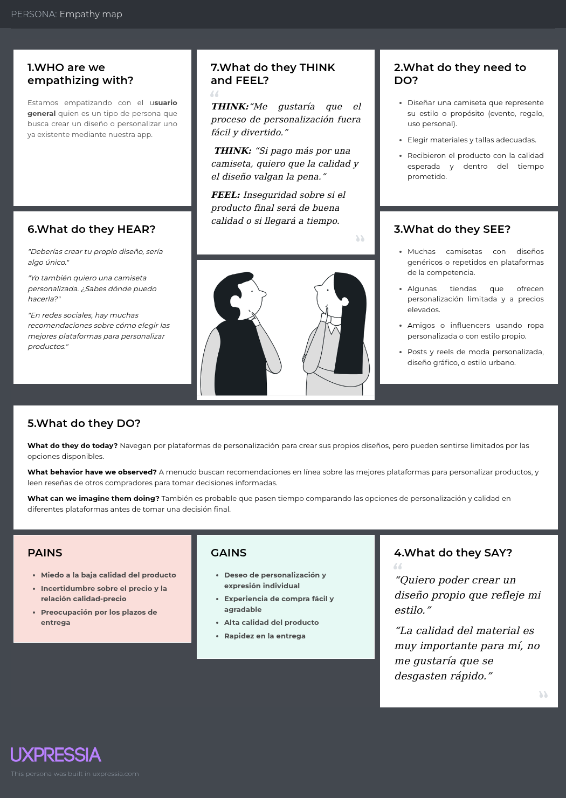
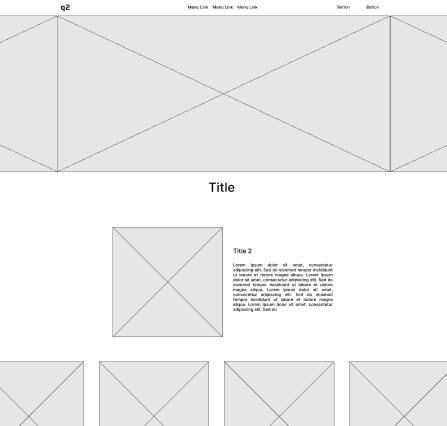
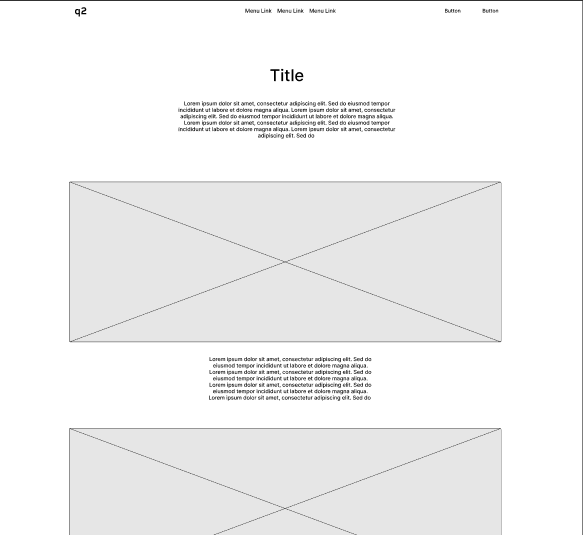
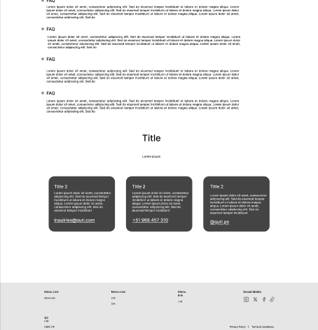
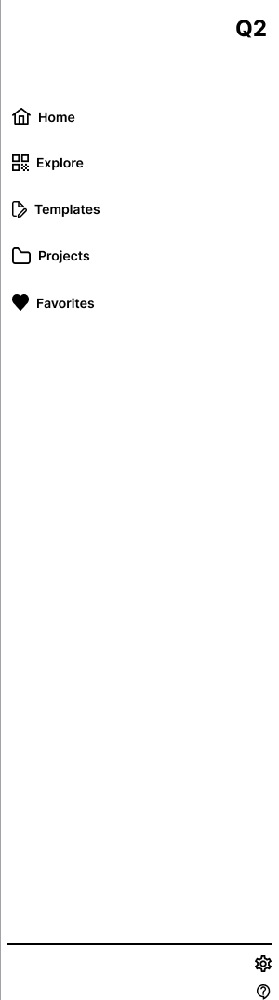
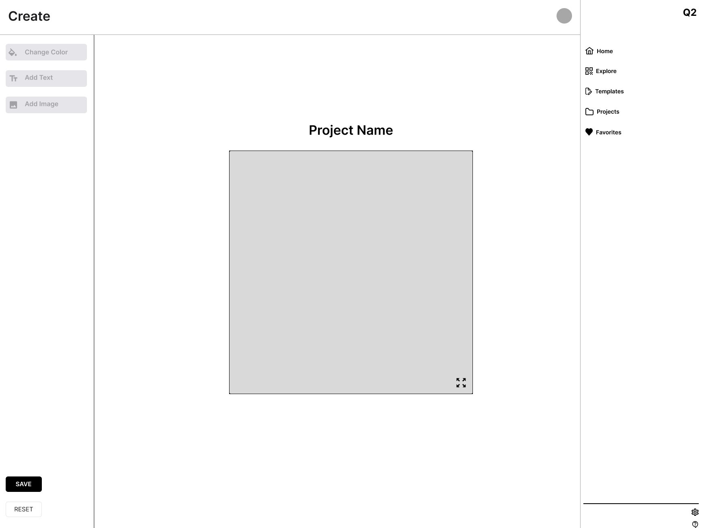

Universidad Peruana de Ciencias Aplicadas

Ingeniería de Software

Ciclo: 05

Aplicaciones Web

Sección: 4395

Docente: Angel Augusto Velasquez Nuñez

TB1

Startup: Q2

Abril 2025

# Registro de versiones

| Versión | Fecha | Autor | Descripción de modificación |
|----|----|----|----|
| 1 | 24/04/2025 | Q2 | Para esta primera entrega hemos empezado definiendo el proyecto entero desde el punto de los requisitos, análisis de entrevistas, desarrollo de la landing page, diseño de la misma, etc. Esta primera entrega tiene por objetivo sentar las bases para que el proyecto se desarrolle de la mejor manera, aplicando buenas prácticas en todos los aspectos que se han visto. Así mismo hemos trabajado en el primer sprint con resultados satisfactorios. En ese sentido también hemos documentado el proceso a traves de GitHub y Jira . |

# 

# Project Report Collaboration Insights

Link de la organización: [<u>https://github.com/q2-aplicaciones-web</u>](https://github.com/q2-aplicaciones-web) 

Contenido

[Registro de versiones 2](#registro-de-versiones)

[Project Report Collaboration Insights 3](#project-report-collaboration-insights)

[Student Outcome 8](#student-outcome)

[1. Capítulo I: Introducción 10](#capítulo-i-introducción)

> [1.1. Startup Profile 10](#startup-profile)
>
> [1.1.1. Descripción de la Startup 10](#descripción-de-la-startup)
>
> [1.1.2. Perfiles de integrantes del equipo 11](#perfiles-de-integrantes-del-equipo)
>
> [1.2. Solution Profile 13](#solution-profile)
>
> [1.2.1. Antecedentes y problemática 13](#antecedentes-y-problemática)
>
> [1.2.2. Lean UX Process 14](#lean-ux-process)
>
> [1.2.2.1. Lean UX Problem Statements 14](#lean-ux-problem-statements)
>
> [1.2.2.2. Lean UX Assumptions 15](#lean-ux-assumptions)
>
> [1.2.2.3. Lean UX Hypothesis Statements 17](#lean-ux-hypothesis-statements)
>
> [1.2.2.4. Lean UX Canvas 18](#lean-ux-canvas)
>
> [1.3. Segmentos objetivo 18](#segmentos-objetivo)

[2. Capítulo II: Requirements Elicitation & Analysis 20](#capítulo-ii-requirements-elicitation-analysis)

> [2.1. Competidores 20](#competidores)
>
> [2.1.1. Análisis competitivo 21](#análisis-competitivo)
>
> [2.1.2. Estrategias y tácticas frente a competidores 25](#estrategias-y-tácticas-frente-a-competidores)
>
> [2.2. Entrevistas 26](#entrevistas)
>
> [2.2.1. Diseño de Entrevistas 26](#diseño-de-entrevistas)
>
> [2.2.2. Registro de entrevistas 27](#registro-de-entrevistas)
>
> [2.2.3. Análisis de entrevistas 33](#análisis-de-entrevistas)
>
> [2.3. Needfinding 37](#needfinding)
>
> [2.3.1. User Personas 37](#user-personas)
>
> [2.3.2. User Task Matrix 38](#user-task-matrix)
>
> [2.3.3. User Journey Mapping 40](#user-journey-mapping)
>
> [2.3.4. Empathy Mapping 41](#empathy-mapping)
>
> [2.3.5. As-is Scenario Mapping 42](#as-is-scenario-mapping)
>
> [2.4. Ubiquitous Language 42](#ubiquitous-language)

[3. Capítulo III: Requirements Specification 44](#capítulo-iii-requirements-specification)

> [3.1. To-Be Scenario Mapping 44](#to-be-scenario-mapping)
>
> [3.2. User Stories 44](#user-stories)
>
> [3.3. Impact Mapping 59](#impact-mapping)
>
> [3.4. Product Backlog 59](#product-backlog)

[4. Capítulo IV: Product Design 65](#capítulo-iv-product-design)

> [4.1. Style Guidelines 65](#style-guidelines)
>
> [4.1.1. General Style Guidelines 66](#general-style-guidelines)
>
> [4.1.2. Web Style Guidelines 72](#web-style-guidelines)
>
> [4.2. Information Architecture 78](#information-architecture)
>
> [4.2.1. Organization Systems 78](#organization-systems)
>
> [4.2.2. Labeling Systems 80](#labeling-systems)
>
> [4.2.3. SEO Tags and Meta Tags 81](#seo-tags-and-meta-tags)
>
> [4.2.4. Searching Systems 85](#searching-systems)
>
> [4.2.5. Navigation Systems 87](#navigation-systems)
>
> [4.3. Landing Page UI Design 89](#landing-page-ui-design)
>
> [4.3.1. Landing Page Wireframe 89](#landing-page-wireframe)
>
> [4.3.2. Landing Page Mock-up 97](#landing-page-mock-up)
>
> [4.4. Web Applications UX/UI Design 103](#web-applications-uxui-design)
>
> [4.4.1. Web Applications Wireframes 103](#web-applications-wireframes)
>
> [4.4.2. Web Applications Wireflow Diagrams 134](#web-applications-wireflow-diagrams)
>
> [4.4.3. Web Applications Mock-ups 143](#web-applications-mock-ups)
>
> [4.4.4. Web Applications User Flow Diagrams 170](#web-applications-user-flow-diagrams)
>
> [4.5. Web Applications Prototyping 176](#web-applications-prototyping)
>
> [4.6. Domain-Driven Software Architecture 176](#domain-driven-software-architecture)
>
> [4.6.1. Software Architecture Context Diagram 176](#software-architecture-context-diagram)
>
> [4.6.2. Software Architecture Container Diagram 177](#software-architecture-container-diagram)
>
> [4.6.3. Software Architecture Componentes Diagrams 178](#software-architecture-componentes-diagrams)
>
> [4.7. Software Object-Oriented Design 185](#software-object-oriented-design)
>
> [4.7.1. Class Diagrams 185](#class-diagrams)
>
> [4.7.2. Class Dictionary 189](#class-dictionary)
>
> [4.8. Database Design 192](#database-design)
>
> [4.8.1. Database Diagram 192](#database-diagram)

[5. Capítulo V: Product Implementation, Validation & Deployment 195](#capítulo-v-product-implementation-validation-deployment)

> [5.1. Software Configuration Management 195](#software-configuration-management)
>
> [5.1.1. Software Development Environment Configuration 195](#software-development-environment-configuration)
>
> [5.1.2. Source Code Management 201](#source-code-management)
>
> [5.1.3. Source Code Style Guide & Conventions 203](#source-code-style-guide-conventions)
>
> [5.1.4. Software Deployment Configuration 205](#software-deployment-configuration)
>
> [5.2. Landing Page, Services & Applications Implementation 205](#landing-page-services-applications-implementation)
>
> [5.2.1. Sprint 1 205](#sprint-1)
>
> [5.2.1.1. Sprint Planning 1 206](#sprint-planning-1)
>
> [5.2.1.2. Aspect Leaders and Collaborators 208](#aspect-leaders-and-collaborators)
>
> [5.2.1.3. Sprint Backlog 1 209](#sprint-backlog-1)
>
> [5.2.1.4. Development Evidence for Sprint Review 211](#development-evidence-for-sprint-review)
>
> [5.2.1.5. Execution Evidence for Sprint Review 214](#execution-evidence-for-sprint-review)
>
> [5.2.1.6. Services Documentation Evidence for Sprint Review 217](#services-documentation-evidence-for-sprint-review)
>
> [5.2.1.7. Software Deployment Evidence for Sprint Review 219](#software-deployment-evidence-for-sprint-review)
>
> [5.2.1.8. Team Collaboration Insights during Sprint 219](#team-collaboration-insights-during-sprint)

[Conclusiones 219](#conclusiones)

[Bibliografía: 221](#bibliografía)

[Anexos 221](#anexos)

# Student Outcome

ABET – EAC - Student Outcome 5

Criterio: La capacidad de funcionar efectivamente en un equipo cuyos miembros

juntos proporcionan liderazgo, crean un entorno de colaboración e inclusivo,

establecen objetivos, planifican tareas y cumplen objetivos.

En el siguiente cuadro se describe las acciones realizadas y enunciados de

conclusiones por parte del grupo, que permiten sustentar el haber alcanzado el logro

del ABET – EAC - Student Outcome 5.

<table>
<colgroup>
<col style="width: 33%" />
<col style="width: 33%" />
<col style="width: 33%" />
</colgroup>
<thead>
<tr>
<th>Criterio específico</th>
<th>Acciones realizadas</th>
<th>Conclusiones</th>
</tr>
<tr>
<th>Trabaja en equipo para proporcionar liderazgo en forma conjunta</th>
<th>TB1: Durante el desarrollo del proyecto, implementamos un sistema donde cada integrante lideró diferentes aspectos del trabajo según sus fortalezas. Por ejemplo, en la fase de Requirements Elicitation, coordiné las entrevistas con usuarios mientras mis compañeros se encargaron del análisis competitivo. En la etapa de diseño, otro compañero tomó el liderazgo en la creación de wireframes, mientras yo me enfoqué en la arquitectura de información. Realizamos reuniones semanales donde cada responsable presentaba avances y recibía retroalimentación del equipo.</th>
<th>TB1: El liderazgo distribuido nos permitió aprovechar las habilidades individuales de cada miembro del equipo, logrando mejores resultados en cada fase del proyecto. La rotación de responsabilidades fomentó el crecimiento personal y profesional de todos los integrantes. Esta estrategia de liderazgo compartido se evidencia en la cohesión del producto final y en la consistencia de los entregables a lo largo del proyecto.</th>
</tr>
<tr>
<th>
Crea un entorno colaborativo e

inclusivo, establece metas,

planifica tareas y cumple

objetivos.
</th>
<th>TB1: Establecimos un repositorio compartido en GitHub para mantener un control de versiones y facilitar la colaboración asincrónica. Utilizamos herramientas como Jira para la planificación de tareas y Figma para el diseño colaborativo. Implementamos metodologías ágiles con sprints semanales y daily standups para mantener una comunicación constante. Durante el Sprint 1, dividimos el trabajo según el Product Backlog, asignando tareas específicas a cada miembro pero manteniendo sesiones de colaboración para resolver problemas complejos. Todas las decisiones importantes se tomaron por consenso, asegurando que cada opinión fuera escuchada y valorada.</th>
<th>TB1: La implementación de herramientas colaborativas y metodologías ágiles nos permitió mantener un flujo de trabajo eficiente a pesar de los diferentes horarios y responsabilidades de cada miembro. El entorno inclusivo que creamos fomentó la participación activa de todos los integrantes, enriqueciendo el proyecto con diversas perspectivas. El cumplimiento del 100% de los objetivos planteados para el Sprint 1 demuestra la efectividad de nuestra planificación y el compromiso del equipo. La documentación detallada del proyecto refleja una comunicación clara y una colaboración exitosa.</th>
</tr>
</thead>
<tbody>
</tbody>
</table>

# Capítulo I: Introducción

## Startup Profile

### Descripción de la Startup

Teelab de Q2 es una innovadora plataforma digital que permite a los usuarios diseñar y personalizar camisetas de manera intuitiva y creativa. Con una amplia gama de opciones que incluyen estampados únicos, variados colores de camiseta y figuras personalizables, esta aplicación se dirige no solo a personas comunes que buscan expresarse a través de su vestimenta, sino también a diseñadores de moda y empresas que desean crear productos a medida. Al facilitar el proceso de diseño, Teelab empodera a sus usuarios para que expresen su individualidad y creatividad, fomentando la moda personalizada y el diseño colaborativo.

**Misión**: Nuestra misión es ofrecer una plataforma accesible y fácil de utilizar que permita a las personas crear y personalizar sus propias camisetas, promoviendo la autoexpresión y la creatividad. Buscamos conectar a diseñadores emergentes y marcas establecidas con un público más amplio, brindando herramientas que faciliten la materialización de ideas únicas y auténticas en prendas de vestir.

**Visión**: Nuestra visión es convertirnos en la plataforma líder de diseño de moda personalizada, donde cada persona tenga la posibilidad de ser tanto creador como consumidor. Aspiramos a transformar la industria de la moda mediante la integración de la tecnología y la personalización, y a establecer un ecosistema que valore la diversidad creativa y la expresión individual en la vestimenta. Queremos ser reconocidos por nuestra capacidad para inspirar y empoderar a las personas en su recorrido de diseño, estableciendo un nuevo estándar en la experiencia de compra de moda.

### Perfiles de integrantes del equipo

<table>
<colgroup>
<col style="width: 50%" />
<col style="width: 50%" />
</colgroup>
<thead>
<tr>
<th colspan="2">
Alumno: Aleman Romano, Dante Mateo

Código: u202319963

Carrera: Ingeniería de Software
</th>
</tr>
<tr>
<th style="text-align: center;"></th>
<th>Soy estudiante de Ingeniería de Software en UPC, con 19 años y en el quinto ciclo. Apasionado por tecnología y videojuegos, busco proyectos innovadores con impacto positivo. Con habilidades colaborativas, aspiro a contribuir y aprender en equipo, enfrentando objetivos y desafíos tecnológicos con determinación.</th>
</tr>
<tr>
<th colspan="2">
Alumno: Contreras Peralta, Fabrizio Alessandro

Código: U202319889

Carrera: Ingeniería de Software
</th>
</tr>
<tr>
<th style="text-align: center;"></th>
<th>Soy Fabrizio Contreras tengo 20 años y actualmente soy estudiante de la carrera de Ingeniería de Software en la UPC. Me considero una persona tanto creativa como resiliente. Siento gran pasión por el mundo tecnológico, las inteligencias artificiales y los videojuegos. Busco pertenecer a proyectos innovadores y de gran incidencia.</th>
</tr>
<tr>
<th colspan="2">
Alumno: Acuña Corahua, Jonatan Ariel

Código: u20211b995

Carrera: Ingeniería de software
</th>
</tr>
<tr>
<th style="text-align: center;"></th>
<th><blockquote>

Soy estudiante del 5to ciclo de la carrera de Ingeniería de Software en la UPC. Me gustó la carrera tras aprender desarrollo web y desde entonces, sigo aprendiendo para mejorar mis habilidades cada vez más. Me gusta aprender sobre las nuevas tecnologías de la web, jugar videojuegos y de vez en cuando salir en bicicleta.

</blockquote></th>
</tr>
<tr>
<th colspan="2">
Alumno: Curipaco Huayllani, Neil Aldrin Wilhelm

Código: u20231b866

Carrera: Ingeniería de Software
</th>
</tr>
<tr>
<th></th>
<th>Soy Neil Curipaco Huayllani. Estoy cursando el 4to ciclo de la carrera de Ingeniería de Software en la UPC. Me gusta jugar videojuegos, aprender cosas nuevas, escuchar música y mejorar mis habilidades para ser de ayuda en el equipo de trabajo del que formo parte.</th>
</tr>
<tr>
<th colspan="2">
Alumno: Diego Epifanio, Paredes Soto

Código: u20221a710

Carrera: Ingeniería de Software
</th>
</tr>
<tr>
<th style="text-align: center;"></th>
<th>Soy Diego Paredes, estudiante de la UPC y tengo 20 años. Mis pasatiempos son los videojuegos y el arte. Busco crear proyectos que incorpore el arte y la tecnología, y que genere un cambio a futuro para personas con mi mismo pensamiento.</th>
</tr>
</thead>
<tbody>
</tbody>
</table>

## Solution Profile

### Antecedentes y problemática

**Who (Quién):**

Los principales involucrados en Teelab son los consumidores que buscan expresarse a través de camisetas personalizadas, así como diseñadores de moda independientes y empresas que desean crear productos únicos para sus marcas. Teelab actúa como un puente entre estos grupos, ofreciendo una plataforma donde pueden materializar sus ideas de diseño.

**What (Qué):**

Teelab es una aplicación web que permite a los usuarios diseñar y personalizar camisetas, eligiendo entre diversas opciones de estampados, colores y figuras. La plataforma está diseñada para ser intuitiva y accesible, brindando herramientas que facilitan la creación de prendas únicas que reflejan la individualidad de cada usuario.

**Where (Dónde):**

Teelab opera como una aplicación web, accesible desde cualquier dispositivo con conexión a Internet. Esto permite a los usuarios diseñar sus camisetas desde la comodidad de su hogar, en su lugar de trabajo, o en cualquier otro lugar donde se encuentren.

**When (Cuándo):**

La iniciativa de Teelab nace en un momento de creciente demanda por la personalización en el vestir, donde los consumidores buscan alternativas a la moda producción en masa. La plataforma está disponible para su uso inmediato, permitiendo que los usuarios comiencen a diseñar en el momento que lo deseen.

**Why (Por qué):**

Teelab se desarrolla en respuesta a la necesidad de un enfoque más personalizado en la moda, permitiendo a los individuos expresar su creatividad y estilo personal. La visión de la empresa es transformar la experiencia de compra de moda, brindando a los usuarios la oportunidad de ser tanto diseñadores como consumidores.

**How (Cómo):**

Teelab ofrece una interfaz amigable y fácil de usar, donde los usuarios pueden arrastrar y soltar elementos para personalizar sus camisetas. Una vez que el diseño está completo, las camisetas son producidas bajo demanda, lo que asegura un enfoque sostenible y responsable en la industria de la moda.

**How much (Cuánto):**

El precio de las camisetas personalizadas variará según el diseño, los materiales seleccionados y la cantidad de productos ordenados. Teelab se compromete a ofrecer precios competitivos que se adapten a diferentes presupuestos, permitiendo que más personas disfruten de la experiencia de diseñar sus propias camisetas.

### Lean UX Process

#### Lean UX Problem Statements

Los diseñadores gráficos, clientes individuales y marcas emergentes enfrentan actualmente diversas dificultades para producir prendas personalizadas de manera eficiente. Los diseñadores suelen carecer de acceso directo a canales de fabricación, lo que complica llevar sus diseños al mercado sin incurrir en costos elevados o procesos logísticos complejos. Los clientes individuales que desean prendas personalizadas para uso propio o eventos especiales se enfrentan a interfaces poco intuitivas o a procesos largos y confusos para crear un diseño único. Según ADN Digital, las experiencias personalizadas son aquellas que se adaptan a las necesidades y preferencias individuales de cada consumidor, lo que se puede lograr a través de varias técnicas que incluyen recopilación y análisis de datos, segmentación y uso de la tecnología (Bahena, 2024). Por otro lado, los emprendedores y marcas pequeñas desean ofrecer productos personalizados sin asumir los altos costos de inventario, producción y gestión logística, pero las plataformas actuales no ofrecen soluciones integradas que conecten todas estas necesidades.​

Las plataformas existentes suelen estar fragmentadas: unas se enfocan solo en diseño, otras solo en producción, sin una integración que permita una experiencia fluida entre diseñadores, clientes y fabricantes. Esto genera tiempos de entrega largos, errores en producción y limitaciones en la personalización en tiempo real. Un estudio de Twilio reveló que el 49% de las empresas de retail ya personalizan sus experiencias de compra, destacando la importancia de la personalización en la satisfacción del cliente (Bahena, 2024).​

Nuestra solución busca ofrecer una plataforma web integral donde los usuarios puedan diseñar polos con facilidad, visualizar sus creaciones en tiempo real y enviarlas automáticamente a fabricantes aliados, eliminando la necesidad de intermediarios y reduciendo los tiempos de producción. Este ecosistema colaborativo permitirá a los diseñadores monetizar sus ideas, a los clientes disfrutar de prendas personalizadas y a los fabricantes recibir pedidos listos para su ejecución sin complicaciones adicionales.

*¿Cómo podemos facilitar un ecosistema digital donde diseñadores, clientes y fabricantes colaboren fácilmente para crear, personalizar y producir polos únicos de forma eficiente y sin fricciones?*

#### Lean UX Assumptions

Se asume que los diseñadores gráficos desean una forma rápida y accesible de llevar sus diseños al mercado sin encargarse de la logística de producción.

- Se asume que los diseñadores gráficos desean una forma rápida y accesible de llevar sus diseños al mercado sin encargarse de la logística de producción.

<!-- -->

- Se asume que los clientes individuales valoran la posibilidad de personalizar sus prendas de manera sencilla, visualizando los cambios en tiempo real.

<!-- -->

- Se asume que los emprendedores y marcas pequeñas buscan vender productos personalizados sin tener que gestionar inventarios ni procesos de fabricación complejos.

<!-- -->

- Se asume que los usuarios prefieren una plataforma todo-en-uno que integre diseño, visualización y producción sin necesidad de utilizar múltiples servicios o herramientas externas.

<!-- -->

- Se asume que los fabricantes están interesados en recibir pedidos digitales claros y organizados para optimizar su flujo de trabajo y producción.

**Business Assumptions**

Creemos que nuestros clientes necesitan una solución integral que les permita diseñar, personalizar y producir polos de manera sencilla, sin tener que encargarse de procesos técnicos, logísticos o de manufactura.

Estas necesidades se pueden resolver mediante la implementación de una plataforma web colaborativa que integre un editor de diseño intuitivo, visualización en tiempo real y conexión directa con fabricantes para producir prendas bajo demanda.

Nuestros clientes iniciales son diseñadores gráficos independientes, clientes individuales que desean prendas únicas, y marcas o emprendedores que buscan ofrecer productos personalizados sin preocuparse por el inventario o la producción.

El valor principal que nuestros clientes desean de nuestro servicio es la posibilidad de crear polos únicos con facilidad, rapidez y sin intermediarios, optimizando su tiempo y reduciendo costos operativos.

Además de la personalización, los clientes se beneficiarán de una experiencia de usuario fluida, la posibilidad de trabajar dentro de un ecosistema multiusuario y la automatización del proceso de envío a fabricación, lo que asegura eficiencia y precisión en los pedidos.

Planeamos adquirir la mayoría de nuestros clientes a través de campañas de marketing digital dirigidas a diseñadores creativos, usuarios de redes sociales interesados en productos personalizados y emprendedores que buscan nuevas oportunidades de negocio sin grandes inversiones iniciales.

Planeamos generar ingresos mediante un modelo mixto: comisiones por cada polo producido y vendido, planes premium con funcionalidades adicionales para diseñadores o marcas, y tarifas de suscripción para fabricantes que deseen formar parte de la red de producción.

Nuestra principal competencia en el mercado son otras plataformas de personalización de ropa, servicios de impresión bajo demanda, y tiendas tradicionales que ofrecen productos personalizados con menos flexibilidad creativa.

Superaremos a la competencia gracias a nuestra propuesta de valor centrada en la colaboración entre usuarios, la automatización del proceso de fabricación, una interfaz de diseño intuitiva, y una red confiable de fabricantes que garantiza producción eficiente y de calidad.

El mayor riesgo es la saturación del mercado con soluciones similares y la resistencia inicial de los usuarios a migrar de procesos tradicionales o plataformas conocidas a una nueva propuesta.

Abordaremos este riesgo mediante estrategias de marketing centradas en los beneficios diferenciales de nuestra plataforma, destacando especialmente la posibilidad de que cualquier persona, sin conocimientos técnicos, pueda crear polos únicos y expresar su creatividad a través del diseño personalizado. Mostraremos el proceso completo de forma clara y amigable, reforzando la facilidad de uso y el valor de tener una prenda hecha a la medida de su estilo o identidad.

#### Lean UX Hypothesis Statements 

Creemos que al implementar una plataforma web que permita a los usuarios diseñar y personalizar polos de forma intuitiva, visualizar los resultados en tiempo real y conectar automáticamente con fabricantes para la producción bajo demanda, facilitaremos la expresión creativa de los usuarios y reduciremos las barreras de entrada a la creación y venta de prendas personalizadas. Según un estudio de Boston Consulting Group (BCG), entre un 50% y un 70% de los consumidores están dispuestos a pagar más por productos o servicios sostenibles, dependiendo de la industria y el tipo de producto (El Comercio, 2022).​

Sabremos que hemos tenido éxito cuando los usuarios comiencen a crear y ordenar sus propios diseños con facilidad, aumentando el número de polos personalizados producidos y disminuyendo la necesidad de que los diseñadores gestionen procesos externos como la fabricación y logística. Esto se alinea con las tendencias identificadas por Shopify (2023), donde se señala que la impresión bajo demanda está permitiendo a los emprendedores lanzar marcas sin asumir riesgos logísticos ni inventarios innecesarios.​

Creemos que al brindar una experiencia de diseño fluida y accesible para cualquier persona sin importar su nivel técnico, permitiremos a los usuarios expresarse a través de prendas únicas, lo que fomentará la participación activa en la plataforma y el deseo de compartir sus creaciones. Estudios de Adobe (2022) confirman que los usuarios están dispuestos a pagar más por productos que ellos mismos han personalizado, lo cual indica un fuerte vínculo emocional con los artículos personalizados.​

Sabremos que hemos tenido éxito cuando observemos un aumento en la cantidad de diseños únicos creados, una alta tasa de conversión de diseño a pedido, y una mayor satisfacción por parte de los diseñadores, clientes y fabricantes al interactuar dentro del ecosistema.

#### Lean UX Canvas

## Segmentos objetivo

**Segmento objetivo \#1: Diseñadores gráficos:** Profesionales o creativos que buscan una forma sencilla de llevar sus diseños a la producción sin necesidad de gestionar la fabricación.

**Aspectos demográficos:**

- Sexo: Sin distinción de género.

<!-- -->

- Edades: De 18 a 45 años.

<!-- -->

- Nivel socioeconómico: Medio a medio-alto.

**Aspectos geográficos:**

- Nacionalidad: Sin restricciones, con enfoque inicial en diseñadores de habla hispana.

<!-- -->

- Zona geográfica en la que viven: Principalmente áreas urbanas con acceso a internet y dispositivos digitales.

<!-- -->

- Departamento: No aplica.

**Aspectos psicográficos:**

- Este segmento está compuesto por personas creativas que buscan plataformas que les permitan transformar sus ideas en productos tangibles.

<!-- -->

- Valoran herramientas intuitivas que agilicen el proceso de diseño y venta.

<!-- -->

- Tienen conocimientos básicos o avanzados de diseño gráfico y buscan monetizar su talento sin encargarse de la fabricación o logística.

<!-- -->

- Son usuarios activos de redes sociales, donde promueven sus diseños y buscan visibilidad.

**Segmento objetivo \#2: Clientes individuales:** Personas interesadas en personalizar prendas para uso propio, regalos o eventos especiales.

**Aspectos demográficos:**

- Sexo: Sin distinción de género.

<!-- -->

- Edades: De 16 a 60 años.

<!-- -->

- Nivel socioeconómico: Medio a medio-alto.

**Aspectos geográficos:**

- Nacionalidad: Sin restricciones, con enfoque inicial en mercados latinoamericanos.

<!-- -->

- Zona geográfica en la que viven: Principalmente áreas urbanas y suburbanas con acceso a servicios de e-commerce.

<!-- -->

- Departamento: No aplica.

**Aspectos psicográficos:**

- Buscan productos únicos y personalizados que reflejen su estilo o que tengan valor emocional.

<!-- -->

- Suelen comprar en línea y valoran la experiencia digital fácil y rápida.

<!-- -->

- Participan en eventos, celebraciones o grupos donde se utilizan prendas personalizadas (cumpleaños, despedidas, clubes, etc.).

<!-- -->

- Valoran la personalización como forma de expresión individual.

**Segmento objetivo \#3: Marcas o emprendedores:** Negocios que desean ofrecer productos personalizados a sus clientes sin gestionar inventarios o procesos de fabricación.

**Aspectos demográficos:**

- Sexo: Sin distinción de género.

<!-- -->

- Edades: De 20 a 50 años.

<!-- -->

- Nivel socioeconómico: Medio a alto, dependiendo del tamaño del negocio.

**Aspectos geográficos:**

- Nacionalidad: Sin restricciones, con enfoque inicial en emprendedores digitales de habla hispana.

<!-- -->

- Zona geográfica en la que operan: Principalmente zonas urbanas, con acceso a plataformas de venta en línea.

<!-- -->

- Departamento: No aplica.

**Aspectos psicográficos:**

- Este segmento está conformado por emprendedores, marcas emergentes y pequeñas empresas que desean comercializar ropa personalizada.

<!-- -->

- Buscan soluciones digitales que les permitan lanzar productos sin grandes inversiones en infraestructura o stock.

- Valoran la automatización y la conexión directa con fabricantes para escalar su negocio.

- Son proactivos en redes sociales y plataformas de e-commerce, buscando diferenciar su marca a través de la personalización.

# Capítulo II: Requirements Elicitation & Analysis

## Competidores

A continuación se realizará un análisis comparativo entre ‘TeeLab’ y los principales competidores que serían: Custom Ink, Spreadshirt y Rafasshop.

Mediante este análisis competitivo se buscará estrategias efectivas para sobresalir en el mercado.

### Análisis competitivo

<table style="width:100%;">
<colgroup>
<col style="width: 15%" />
<col style="width: 7%" />
<col style="width: 10%" />
<col style="width: 19%" />
<col style="width: 16%" />
<col style="width: 15%" />
<col style="width: 14%" />
</colgroup>
<thead>
<tr>
<th colspan="7" style="text-align: left;">Competitive Analysis Landscape</th>
</tr>
<tr>
<th colspan="2">
¿Por qué llevar a

cabo este análisis?
</th>
<th colspan="5" style="text-align: left;">Nos es importante como marca, analizar la competencia en busca de oportunidades mediante la identificación de fortalezas y debilidades.</th>
</tr>
<tr>
<th colspan="3" style="text-align: left;">(colocar nombre y logo)</th>
<th style="text-align: left;">TeeLab</th>
<th style="text-align: left;">
Custom Ink

</th>
<th>
Spreadshirt

</th>
<th>
Rafasshop

</th>
</tr>
<tr>
<th rowspan="2" style="text-align: left;">Perfil</th>
<th colspan="2">Overview</th>
<th style="text-align: left;">Es una plataforma virtual que permite la personalización de diseño y ropa. Además, permite la venta de diseños y ganancias para fabricantes.</th>
<th>Es una plataforma virtual que permite la personalización de ropa y creación de diseños</th>
<th>Plataforma virtual que permite la compra y venta de ropa personalizada</th>
<th>Plataforma virtual especializada en la venta de ropa personalizable</th>
</tr>
<tr>
<th colspan="2">
Ventaja

competitiva

¿Qué valor

ofrece a los

clientes?
</th>
<th style="text-align: left;">
-Permite la venta de artistas y diseñadores independientes.

-Ofrece ganancias a fabricantes por prenda.

-Fácil entendimiento de herramientas de diseño
</th>
<th>
-Facilidad de uso en la creación de diseños.

-Satisfacción con resultados de calidad
</th>
<th>
-Alcance global en sus envíos

-Rentabilidad monetaria a diseñadores
</th>
<th>
-Envios rapidos en España

-Amplia variedad de prendas personalizables
</th>
</tr>
<tr>
<th rowspan="2" style="text-align: left;">Perfil de Marketing</th>
<th colspan="2">Mercado objetivo</th>
<th>
-diseñadores

-público interesado

-empresas y negocios
</th>
<th>
-empresas y negocios

-equipos.

-Todo público.
</th>
<th>
-diseñadores

-empresas y negocios

-público interesado

-organizaciones y comunidades
</th>
<th>
-empresas y negocios

-equipos.

-imprentas y talleres
</th>
</tr>
<tr>
<th colspan="2">Estrategias de marketing</th>
<th style="text-align: left;">-publicidad en redes sociales</th>
<th>
-publicidad en redes sociales

-campañas de retargeting online

-publicidad por asociaciones.
</th>
<th>
-publicidad en redes sociales

-publicidad por influencers o diseñadores.

-campañas de PPC
</th>
<th>
-marketing de guerrilla

-publicidad por asociación con marcas

-Envío de gmail y buzoneo

-Partición en eventos
</th>
</tr>
<tr>
<th rowspan="3" style="text-align: left;">Perfil de Producto</th>
<th colspan="2">Productos &amp; Servicios</th>
<th style="text-align: left;">
Ofrece personalización y creación de diseños únicos.

Además, la interacción entre cliente, diseñador y fabricante de manera inmediata.
</th>
<th>Ofrece personalización de una gran variedad de prendas y crear diseños propios.</th>
<th>Ofrece personalización y creación de diseño en la ropa. Además, la posibilidad de vender tus propios diseños</th>
<th>Ofrece una fácil personalización y diseño en la ropa. Los usuarios pueden vender sus diseños.</th>
</tr>
<tr>
<th colspan="2">Precios &amp; Costos</th>
<th style="text-align: left;">Se tomaría una justa comisión por el producto vendido y creado. Este varía según la prenda, tamaño y cantidad. Llegando como mínimo a 11 USD un polo personalizado.</th>
<th>Los precios varían según país de envío, tamaño, cantidad. Siendo mayores a 26 USD un polo personalizado..</th>
<th>Los precios varían según el producto y diseño. Siendo un estimado de mayores a 17 USD un polo personalizado.</th>
<th>Los precios varían según el producto, color, cantidad, tamaño. El precio estimado es mayor a 11 USD un polo.</th>
</tr>
<tr>
<th colspan="2">Canales de distribución</th>
<th style="text-align: left;">Web y Móvil</th>
<th>Web</th>
<th>Web y Móvil</th>
<th>Web</th>
</tr>
<tr>
<th rowspan="4" style="text-align: left;">Análisis SWOT</th>
<th colspan="2">Fortalezas</th>
<th style="text-align: left;">Ofrece oportunidades de ganancias a diseñadores, artistas y fabricantes. También, variedad de herramientas de diseño</th>
<th>Permite el uso de libre de imágenes propias y buenos precios para emprendedores</th>
<th>Permite a diseñadores y artistas poder generar ganancias mediante sus diseños</th>
<th style="text-align: left;">Diseño intuitiva y fácil de usar para la personalización de ropa</th>
</tr>
<tr>
<th colspan="2">Debilidades</th>
<th style="text-align: left;">Falta de visibilidad y mantener un contacto agradable entre los usuarios objetivo.</th>
<th style="text-align: left;">No hay posibilidad de realizar envíos individuales de manera internacional.</th>
<th>Solo permite el uso de imágenes disponibles en la app</th>
<th style="text-align: left;">Centrado mayormente en España y menos herramientas para el diseño</th>
</tr>
<tr>
<th colspan="2">Oportunidades</th>
<th style="text-align: left;">Abarcar a un público casual de manera más amplia, y brindar herramientas útiles para el diseño de ropa.</th>
<th style="text-align: left;">Público casual que desea comprar de manera individual</th>
<th style="text-align: left;">Mayor disponibilidad para el uso de diseños más variados o únicos</th>
<th style="text-align: left;">Falta de visibilidad para uso internacional y escasez de herramientas de diseño.</th>
</tr>
<tr>
<th colspan="2">Amenazas</th>
<th style="text-align: left;">Menor visibilidad en el mercado</th>
<th style="text-align: left;">Mayor exposición en el mercado y mayor cantidad de herramientas</th>
<th>Mayor exposición en el mercado para diseñadores y artistas</th>
<th style="text-align: left;">Mayor exposición en España y precios más accesibles</th>
</tr>
</thead>
<tbody>
</tbody>
</table>

### Estrategias y tácticas frente a competidores

Mediante la siguiente tabla se busca realizar estrategias que buscan solucionar o mejorar en lo que falla la competencia con los resultados del Landscape anterior.

<table>
<colgroup>
<col style="width: 35%" />
<col style="width: 64%" />
</colgroup>
<thead>
<tr>
<th style="text-align: left;">Competidores</th>
<th style="text-align: left;">¿Qué debemos de hacer para destacar más frente a nuestros principales competidores?</th>
</tr>
<tr>
<th>
Custom Ink

</th>
<th style="text-align: left;">
Nuestra Startup debe aprovechar la insatisfacción que tienen las personas que desean comprar ropa para ellos mismos.

Brindar accesibilidad en la compra de prendas individuales para nuestro público casual con un precio accesible.
</th>
</tr>
<tr>
<th>
Spreadshirt

</th>
<th style="text-align: left;">
Una desventaja notoria en Spreadshirt es la imposibilidad de uso de imágenes propias sin ser un diseñador en la app o usar de manera libre imágenes de la web.

Consideramos implementar el uso libre de imágenes, bajo ciertas normas en la distribución comercial bajo los reglamentos de copyright. Además, de restar los porcentajes en términos justos por comisión en venta a los artistas o diseñadores.
</th>
</tr>
<tr>
<th>
Rafasshop

</th>
<th style="text-align: left;">Según nuestro equipo hemos decidido brindar una visibilidad a nuestro startup con nuestras estrategias de marketing. También, proporcionarles las herramientas necesarias para la creación de diseños en el público casual y brindar funciones avanzadas para diseñadores y artistas.</th>
</tr>
</thead>
<tbody>
</tbody>
</table>

## Entrevistas

### Diseño de Entrevistas

En esta sección vamos a identificar la información que necesitamos obtener desde los segmentos objetivos previamente trazados. Para la información básica del entrevistado se usará un formulario básico a través del siguiente enlace: [<u>https://docs.google.com/forms/d/e/1FAIpQLSeN95VQkNjjTguK6R0V3ZLIerQQuHjVMv-o2MGmCpnhD_XX2w/viewform?usp=sharing</u>](https://docs.google.com/forms/d/e/1FAIpQLSeN95VQkNjjTguK6R0V3ZLIerQQuHjVMv-o2MGmCpnhD_XX2w/viewform?usp=sharing)

- Formulario para Diseñadores

<!-- -->

- ¿Qué plataformas utilizas actualmente para vender o mostrar tus diseños?

- ¿Estarías interesado en comercializar tus diseños en productos físicos como camisetas y recibir comisiones por las ventas?

- ¿Qué características buscarías en una plataforma para vender tus diseños en camisetas?

- ¿Cómo te gustaría que se promovieran tus diseños dentro de la plataforma?

- ¿Te gustaría recibir pedidos para diseñar camisetas?

<!-- -->

- Formulario para Empresas

<!-- -->

- ¿Qué tipo de clientes suelen solicitar producción de camisetas personalizadas?

- ¿Cuáles son los principales desafíos que enfrentas en la producción y distribución de camisetas con diseños personalizados?

- ¿Trabajas con diseñadores externos o prefieres diseños propios o prediseñados?

- ¿Cómo gestionas actualmente los pedidos personalizados?

<!-- -->

- Formulario para Usuario General

<!-- -->

- ¿Has comprado camisetas con diseños personalizados antes?

- ¿Prefieres comprar camisetas con diseños ya hechos o te gustaría crear el tuyo propio?

- ¿Te gustaría una opción de personalización donde puedas modificar colores, texto o agregar elementos a un diseño?

- ¿Qué aspectos valoras más en una camiseta (calidad del material, precio, originalidad del diseño, etc.)?

- ¿Cuánto estarías dispuesto a pagar por una camiseta personalizada con un diseño único?

- ¿Qué tan importante es para ti la rapidez en la entrega ?

### Registro de entrevistas

**URL de las entrevistas: [<u>upc-pre-202510-1asi0729-4350-Q2-needfinding-sprint-1 1.mp4</u>](https://upcedupe-my.sharepoint.com/:v:/g/personal/u20231b866_upc_edu_pe/EaT2Whd5p5dOpm-3cKi4p_sBsPYWvxHOUhgK05qfy65oow?nav=eyJyZWZlcnJhbEluZm8iOnsicmVmZXJyYWxBcHAiOiJTdHJlYW1XZWJBcHAiLCJyZWZlcnJhbFZpZXciOiJTaGFyZURpYWxvZy1MaW5rIiwicmVmZXJyYWxBcHBQbGF0Zm9ybSI6IldlYiIsInJlZmVycmFsTW9kZSI6InZpZXcifX0%3D&e=cNFgdc)**

**Segmento objetivo \#1: Diseñadores:**

**Entrevista 1:** Grecia Curipaco Huayllani

**Sexo:** Femenino

**Edad:** 24 años

**Instante en el que inicia:** 0 minutos y 5 segundos **Duración:** 4 minutos y 15 segundos

**Resumen:  
**Grecia Curipaco Huayllani, es diseñadora. Aunque actualmente no vende sus diseños, los publica en Behance e Instagram. Está interesada en poder vender sus diseños en camisetas y cree que es vital tener un sistema interactivo y fácil de usar donde los usuarios no solo puedan ver, sino también editar los diseños. Además, aprecia que estos diseños se muestren en maquetas para que los compradores tengan una idea clara de lo que recibirán. Está dispuesta a aceptar pedidos de diseños personalizados porque valora trabajos inusuales y únicos.

**Entrevista 2:** Angela Galdez

**Sexo:** Femenino

**Edad:** 23 años

**Instante en el que inicia:** 4 minutos y 19 segundos **Duración:** 4 minutos y 12 segundos

**Resumen:  
**Ángela Galdez ahora vende y publica sus diseños en Instagram y Facebook, y en otras plataformas ve una oportunidad para llegar a más personas. Su interés se centra en que esta nueva plataforma permita la comunicación directa con los clientes para llegar a acuerdos personalizados, así como el hecho de poder mostrar con detalle las camisetas y permitir la compra directa. También muestra interés para poder recibir calificaciones y comentarios sobre sus diseños. Para ella es fundamental que sus creaciones sean ilustradas con fotos y videos, además de que estarían dispuestos a recibir pedidos personales de camisetas.

**Segmento objetivo \#2: Usuario general:**

**Entrevista 1:** Orianka Buitrón

**Sexo:** Femenino

**Edad:** 18 años

**Instante en el que inicia:** 8 minutos y 31 segundos **Duración:** 3 minutos y 10 segundos

**Resumen:**

Orianka Buitrón, dijo que había comprado camisetas con diseños ya elaborados pero algunas veces no eran de su agrado. Por ello, quiere poder crear su propio diseño y usar una herramienta que pueda editar. Considera que la calidad de los materiales y el diseño son aspectos clave que influyen directamente en el precio. Aunque no le incomoda un leve retraso en la entrega, valora mucho la rapidez del servicio.

**Entrevista 2:** Daniela Gómez

**Sexo:** Femenino

**Edad:** 18 años

**Instante en el que inicia:** 11 minutos y 31 segundos

**Duración:** 3 minutos y 51 segundos

**Resumen:**  
Daniela Gómez, manifestó haber adquirido camisetas con diseños en ocasiones especiales como conciertos y ferias. Le gustaría poder diseñar y reflejar mejor su estilo y cree que es genial estar en la posibilidad de editar los diseños. Hizo énfasis en la calidad del material, ya que en el pasado ha tenido malas experiencias con telas de baja calidad, por lo que pagaría entre 50 y 80 soles por una camiseta que posea una excelente durabilidad y apariencia. Aunque considera importante la rapidez en la entrega, no le incomoda un pequeño retraso.

**Segmento objetivo \#3: Marcas o emprendedores:  
Entrevista 1:** Giuliana Nisbeth

**Sexo:** Femenino

**Edad:** 28 años

**Instante en el que inicia:** 15 minutos y 40 segundos **Duración:** 3 minutos y 21 segundos

**Entrevista 2:** Lenny Torres

**Sexo:** Masculino

**Edad:** 20 años

**Instante en el que inicia:** 18 minutos y 19 minutos **Duración:** 3 minutos y 25 segundos

**Resumen:**

Lenny Torres, afirma que sus clientes principales incluyen tanto instituciones deportivas privadas como públicas, así como varios otros tipos de clubes. Señala la necesidad de satisfacer una gran demanda de camisetas en un corto período de tiempo como el desafío más importante. Su servicio ofrece diseños personalizados, así como la opción de utilizar diseños proporcionados por los clientes, y actualmente gestionan los pedidos a través de procesos predefinidos.

**Resumen:**

Giuliana Nisbeth, señala que cualquier persona puede encargar camisetas personalizadas, ya sean para eventos como campeonatos o instituciones. La mayor parte de los encargos se basa en diseños ya existentes o fotos que se encuentran en Internet. Aunque aceptan tanto diseños externos como propios preestablecidos, se complican cuando los clientes realizan cambios a los últimos detalles sobre el diseño o la cantidad, lo que retrasa los plazos de entrega. Los pedidos actualmente se hacen mayormente por medio de Instagram o WhatsApp.

### Análisis de entrevistas

**Segmento objetivo \#1: Diseñadores:**

| **Pregunta** | **Respuesta** |
|----|----|
| ¿Qué plataformas utilizas actualmente para vender o mostrar tus diseños? | Actualmente se utilizan redes sociales como Instagram, Facebook y plataformas especializadas como Behance para publicar y dar visibilidad a los diseños, aunque no todos han iniciado aún un proceso de venta directa. |
| ¿Estarías interesado en comercializar tus diseños en productos físicos como camisetas y recibir comisiones por las ventas? | Hay un claro interés en comercializar los diseños a través de productos físicos como camisetas, especialmente si existe la posibilidad de recibir comisiones por cada venta realizada. |
| ¿Qué características buscarías en una plataforma para vender tus diseños en camisetas? | Se valora una plataforma que sea intuitiva, interactiva y fácil de usar, que permita a los usuarios visualizar y editar los diseños, y que cuente con maquetas realistas para mostrar cómo lucirá el producto final. También se considera importante que exista comunicación directa con los clientes, la opción de realizar compras dentro de la plataforma, y un sistema de valoraciones y comentarios que fomente la retroalimentación. |
| ¿Cómo te gustaría que se promovieran tus diseños dentro de la plataforma? | Se espera que los diseños sean promovidos mediante maquetas atractivas, así como fotos y videos de alta calidad que muestren claramente los detalles de las camisetas. La presentación visual es clave para captar la atención de los compradores. |
| ¿Te gustaría recibir pedidos para diseñar camisetas? | Existe disposición para aceptar pedidos personalizados, especialmente aquellos que impliquen proyectos únicos o fuera de lo común, ya que representan una oportunidad creativa interesante y una conexión más directa con el cliente. |

**Segmento objetivo \#2: Usuario general:**

| **Pregunta** | **Respuesta** |
|----|----|
| ¿Has comprado camisetas con diseños personalizados antes? | Han comprado camisetas con diseños personalizados en diversas ocasiones, como eventos especiales o compras en tiendas. Sin embargo, en algunos casos, los diseños no han sido del todo satisfactorios o no reflejaban el estilo personal deseado. |
| ¿Prefieres comprar camisetas con diseños ya hechos o te gustaría crear el tuyo propio? | Existe una clara preferencia por tener la opción de crear un diseño propio, ya que esto permite reflejar mejor el estilo personal y obtener un producto más auténtico y satisfactorio. |
| ¿Te gustaría una opción de personalización donde puedas modificar colores, texto o agregar elementos a un diseño? | La posibilidad de editar los diseños modificando elementos como colores, texto o imágenes adicionales es vista como una característica muy positiva y atractiva dentro de una plataforma de personalización. |
| ¿Qué aspectos valoras más en una camiseta (calidad del material, precio, originalidad del diseño, etc.)? | Se valoran principalmente la calidad del material y la originalidad del diseño, ya que estos factores tienen un impacto directo en la satisfacción con el producto. El precio también es relevante, pero está estrechamente relacionado con la durabilidad y apariencia de la prenda. |
| ¿Cuánto estarías dispuesto a pagar por una camiseta personalizada con un diseño único? | El rango estimado va entre 50 y 80 soles, siempre que la camiseta ofrezca una alta calidad en materiales y un diseño distintivo que justifique su valor. |
| ¿Qué tan importante es para ti la rapidez en la entrega? | La rapidez en la entrega es importante y valorada, aunque un pequeño retraso es aceptable siempre que el producto final cumpla con las expectativas en cuanto a calidad y diseño. |

**Segmento objetivo \#3: Marcas o emprendedores:**

| **Pregunta** | **Respuesta** |
|----|----|
| ¿Qué tipo de clientes suelen solicitar producción de camisetas personalizadas? | Los clientes suelen ser diversos, incluyendo instituciones deportivas públicas y privadas, clubes de distintos tipos, y personas que requieren camisetas para eventos específicos como campeonatos. |
| ¿Cuáles son los principales desafíos que enfrentas en la producción y distribución de camisetas con diseños personalizados? | Entre los principales desafíos se encuentran la exigencia de producir grandes cantidades de camisetas en un corto periodo de tiempo, así como los cambios de último minuto por parte de los clientes en cuanto a los diseños o cantidades solicitadas, lo cual puede retrasar los tiempos de entrega. |
| ¿Trabajas con diseñadores externos o prefieres diseños propios o prediseñados? | Se trabaja tanto con diseños propios como con aquellos proporcionados por los clientes. En algunos casos, los diseños se basan en modelos ya existentes o imágenes tomadas de Internet. |
| ¿Cómo gestionas actualmente los pedidos personalizados? | La gestión de pedidos se realiza principalmente mediante canales digitales como Instagram y WhatsApp, o a través de protocolos y procesos previamente establecidos según la organización del proveedor. |

## Needfinding

### User Personas

Segmento Objetivo \#1: Diseñadores

- Segmento Objetivo \#2: Clientes individuales

- Segmento Objetivo \#3: Marcas o emprendedores

### User Task Matrix

### 

<table>
<colgroup>
<col style="width: 28%" />
<col style="width: 33%" />
<col style="width: 19%" />
<col style="width: 19%" />
</colgroup>
<thead>
<tr>
<th>Segmento de Usuario</th>
<th>User Tasks</th>
<th>Frecuencia</th>
<th>Importancia</th>
</tr>
<tr>
<th rowspan="3">Diseñadores</th>
<th>Subir y mostrar sus diseños en camisetas</th>
<th>Alta</th>
<th>Alta</th>
</tr>
<tr>
<th>Recibir pedidos personalizados de clientes</th>
<th>Media Alta</th>
<th>Media Alta</th>
</tr>
<tr>
<th>Visualizar cómo lucen sus diseños en maquetas realistas</th>
<th>Alta</th>
<th>Alta</th>
</tr>
<tr>
<th rowspan="4">Usuario general</th>
<th>Personalizar camisetas (cambiar texto, colores, añadir imágenes)</th>
<th>Alta</th>
<th>Alta</th>
</tr>
<tr>
<th>Comprar camisetas personalizadas de buena calidad</th>
<th>Alta</th>
<th>Alta</th>
</tr>
<tr>
<th>Visualizar antes de comprar (maquetas, simulaciones)</th>
<th>Alta</th>
<th>Alta</th>
</tr>
<tr>
<th>Recibir el pedido en un tiempo razonable</th>
<th>Alta</th>
<th>Media</th>
</tr>
<tr>
<th rowspan="4">
Marcas/

Emprendedores
</th>
<th>Usar diseños propios o aceptar sugerencias del cliente</th>
<th>Media</th>
<th>Alta</th>
</tr>
<tr>
<th>Gestionar pedidos personalizados con cambios (cantidad, diseño)</th>
<th>Alta</th>
<th>Alta</th>
</tr>
<tr>
<th>Comunicarse con el proveedor de forma clara y rápida (chat o mensajes)</th>
<th>Alta</th>
<th>Alta</th>
</tr>
<tr>
<th>Hacer pedidos en volumen para eventos o instituciones</th>
<th>Alta</th>
<th>Alta</th>
</tr>
</thead>
<tbody>
</tbody>
</table>

### User Journey Mapping

### Empathy Mapping

### As-is Scenario Mapping

## Ubiquitous Language

| Término | Definición |
|----|----|
| Designer (Diseñador) | Usuario que crea diseños originales para camisetas y puede ofrecerlos a la venta. |
| Tshirt (Polo) | Camiseta personalizada, unidad principal del catálogo. |
| User (Usuario) | Persona que compra camisetas personalizadas o crea diseños para uso personal. |
| Manufacturer (Fabricante) | Parte encargada de producir físicamente las camisetas según los pedidos recibidos. |
| Design (Diseño) | Composición gráfica creada para ser impresa en polos. |
| Catalog (Catálogo) | Colección de polos y diseños disponibles para exploración o compra. |
| Order (Pedido) | Solicitud formal de uno o más polos, creada por un usuario. |
| Design Studio (Herramienta de diseño) | Herramienta visual dentro de la plataforma que permite la creación o personalización de diseños. |

# Capítulo III: Requirements Specification

## To-Be Scenario Mapping

## User Stories

Para el desarrollo de la aplicación vamos a identificar las necesidades de nuestros usuarios

<table>
<colgroup>
<col style="width: 12%" />
<col style="width: 18%" />
<col style="width: 28%" />
<col style="width: 20%" />
<col style="width: 20%" />
</colgroup>
<thead>
<tr>
<th style="text-align: left;">Epic / Story ID</th>
<th style="text-align: left;">Título</th>
<th style="text-align: left;">Descripción</th>
<th style="text-align: left;">Criterios de Aceptación</th>
<th style="text-align: left;">Relacionado con (Epic ID)</th>
</tr>
<tr>
<th style="text-align: left;">1</th>
<th style="text-align: left;">Registro de usuario</th>
<th style="text-align: left;">Como usuario, quiero registrarme en la plataforma, para poder acceder a todas sus funciones.</th>
<th>
Feature: Registro de cuenta de usuario

Scenario: Registro exitoso

Given el visitante accede al formulario de registro

When completa los campos obligatorios con datos válidos

Then se crea una nueva cuenta de usuario

And el usuario es redirigido a su panel personal
</th>
<th>EP01</th>
</tr>
<tr>
<th>2</th>
<th style="text-align: left;">Inicio de sesión</th>
<th style="text-align: left;">Como usuario, quiero iniciar sesión en mi cuenta, para acceder a mis diseños y pedidos.</th>
<th>
Feature: Inicio de sesión

Scenario: Autenticación exitosa

Given el usuario tiene una cuenta registrada

When ingresa su correo electrónico y contraseña válidos

Then accede a su panel de usuario
</th>
<th>EP01</th>
</tr>
<tr>
<th>3</th>
<th style="text-align: left;">Recuperar contraseña</th>
<th style="text-align: left;">Como usuario, quiero recuperar mi contraseña, para volver a acceder si la olvido.</th>
<th>
Feature: Recuperación de contraseña

Scenario: Solicitud de recuperación

Given el usuario olvida su contraseña

When solicita un enlace de recuperación

Then recibe un correo para restablecer su contraseña
</th>
<th style="text-align: left;"></th>
</tr>
<tr>
<th>4</th>
<th style="text-align: left;">Crear diseño personalizado</th>
<th style="text-align: left;">Como usuario, quiero crear un diseño personalizado de polo, para expresar mi creatividad.</th>
<th>
Feature: Editor de diseño

Scenario: Creación de diseño personalizado

Given el usuario accede al editor de diseño

When selecciona color, texto e imágenes

Then el sistema genera un diseño en tiempo real
</th>
<th>EP02</th>
</tr>
<tr>
<th>5</th>
<th style="text-align: left;">Elegir color del polo</th>
<th style="text-align: left;">Como usuario, quiero seleccionar el color base del polo, para personalizar su apariencia.</th>
<th>
Feature: Personalización de color

Scenario: Cambio de color

Given el usuario está diseñando un polo

When selecciona un color de la paleta

Then el polo cambia al color seleccionado
</th>
<th>EP02</th>
</tr>
<tr>
<th>6</th>
<th style="text-align: left;">Seleccionar talla y género</th>
<th style="text-align: left;">Como usuario, quiero seleccionar la talla y si es de hombre o mujer, para recibir el polo adecuado.</th>
<th>
Feature: Configuración del polo

Scenario: Selección de talla y género

Given el usuario diseña un polo

When selecciona una talla y género

Then esa información queda guardada en el diseño
</th>
<th>EP02</th>
</tr>
<tr>
<th>7</th>
<th style="text-align: left;">Agregar imágenes al diseño</th>
<th style="text-align: left;">Como usuario, quiero subir imágenes para personalizar mi polo con mis propios gráficos.</th>
<th>
Feature: Imagen personalizada

Scenario: Subida de imagen

Given el usuario está en el editor de diseño

When sube una imagen desde su dispositivo

Then la imagen se muestra en el polo
</th>
<th>EP02</th>
</tr>
<tr>
<th>8</th>
<th style="text-align: left;">Ver vista previa en tiempo real</th>
<th style="text-align: left;">Como usuario, quiero ver cómo quedará el diseño final mientras lo edito, para tomar mejores decisiones.</th>
<th>
Feature: Vista previa dinámica

Scenario: Visualización inmediata de cambios

Given el usuario modifica el diseño

When realiza un cambio

Then el polo se actualiza en la vista previa
</th>
<th>EP02</th>
</tr>
<tr>
<th>9</th>
<th style="text-align: left;">Comprar un polo personalizado</th>
<th style="text-align: left;">Como usuario, quiero poder comprar el polo que diseñe, para recibirlo en mi domicilio.</th>
<th>
Feature: Compra de diseño

Scenario: Finalizar compra de diseño propio

Given el usuario ha terminado su diseño

When realiza el pago

Then el pedido se registra para producción
</th>
<th>EP03</th>
</tr>
<tr>
<th>10</th>
<th style="text-align: left;">Explorar diseños populares</th>
<th style="text-align: left;">Como usuario, quiero ver los diseños más populares, para inspirarme o comprarlos.</th>
<th>
Feature: Diseño más populares

Scenario: Filtrado por popularidad

Given el visitante explora el catálogo

When aplica el filtro por popularidad

Then ve una lista de los diseños más valorados
</th>
<th>EP03</th>
</tr>
<tr>
<th>11</th>
<th style="text-align: left;">Filtrar por género</th>
<th style="text-align: left;">Como usuario, quiero ver polos por género (hombre o mujer), para encontrar más fácilmente lo que necesito.</th>
<th>
Feature: Filtro por género

Scenario: Aplicar filtro de género

Given el visitante navega el catálogo

When selecciona 'hombre' o 'mujer'

Then los resultados se ajustan según la selección
</th>
<th>EP03</th>
</tr>
<tr>
<th>12</th>
<th style="text-align: left;">Comprar polo de otro diseñador</th>
<th style="text-align: left;">Como usuario, quiero comprar un diseño hecho por otro usuario, para apoyarlo y usarlo.</th>
<th>
Feature: Compra de diseño público

Scenario: Pedido de diseño ajeno

Given el usuario explora un diseño publicado

When presiona comprar

Then el pedido se procesa con ese diseño
</th>
<th>EP03</th>
</tr>
<tr>
<th>13</th>
<th style="text-align: left;">Agregar a favoritos</th>
<th style="text-align: left;">Como usuario, quiero guardar diseños en favoritos, para verlos después o comprarlos.</th>
<th>
Feature: Favoritos

Scenario: Guardar diseño favorito

Given el usuario visualiza un diseño

When lo marca como favorito

Then aparece en su lista personal de favoritos
</th>
<th>EP03</th>
</tr>
<tr>
<th>14</th>
<th style="text-align: left;">Cambiar contraseña</th>
<th style="text-align: left;">Como usuario, quiero cambiar mi contraseña desde la configuración, para mantener mi cuenta segura.</th>
<th>
Feature: Cambio de contraseña

Scenario: Actualizar contraseña

Given el usuario accede a su perfil

When ingresa una nueva contraseña válida

Then la contraseña se actualiza
</th>
<th>EP04</th>
</tr>
<tr>
<th>15</th>
<th style="text-align: left;">Cambiar idioma a inglés</th>
<th style="text-align: left;">Como usuario, quiero cambiar el idioma del sitio a inglés, para entender mejor la plataforma.</th>
<th>
Feature: Configuración de idioma

Scenario: Cambio de idioma

Given el usuario accede a configuración

When selecciona 'inglés'

Then la interfaz se presenta en inglés
</th>
<th>EP04</th>
</tr>
<tr>
<th>16</th>
<th style="text-align: left;">Editar mi información personal</th>
<th style="text-align: left;">Como usuario, quiero poder modificar mi nombre, dirección o correo, para mantener mi perfil actualizado.</th>
<th>
Feature: Edición de perfil

Scenario: Actualizar datos

Given el usuario está en su perfil

When modifica su nombre, correo o dirección

Then la información se guarda correctamente
</th>
<th>EP04</th>
</tr>
<tr>
<th>17</th>
<th style="text-align: left;">Publicar diseño al catálogo</th>
<th style="text-align: left;">Como usuario, quiero subir mi diseño al catálogo público, para que otros lo vean y lo compren.</th>
<th>
Feature: Publicación de diseño

Scenario: Publicar diseño personalizado

Given el usuario tiene un diseño terminado

When selecciona 'publicar'

Then el diseño aparece en el catálogo público
</th>
<th>EP05</th>
</tr>
<tr>
<th>18</th>
<th style="text-align: left;">Ver mis pedidos anteriores</th>
<th style="text-align: left;">Como usuario, quiero revisar mis pedidos anteriores, para saber qué compré y cuándo.</th>
<th>
Feature: Historial de compras

Scenario: Consultar historial

Given el usuario accede a 'mis pedidos'

When selecciona un pedido

Then se muestra la información completa del mismo
</th>
<th>EP05</th>
</tr>
<tr>
<th>19</th>
<th style="text-align: left;">Comentar en diseños públicos</th>
<th style="text-align: left;">Como usuario, quiero comentar en los diseños de otros, para compartir opiniones o sugerencias.</th>
<th>
Feature: Comentarios

Scenario: Publicar comentario

Given el usuario visualiza un diseño público

When escribe un comentario y lo envía

Then el comentario se muestra debajo del diseño
</th>
<th>EP05</th>
</tr>
<tr>
<th>20</th>
<th style="text-align: left;">Calificar diseño</th>
<th style="text-align: left;">Como usuario, quiero poder darle una calificación a los diseños, para que otros sepan cuáles son buenos.</th>
<th>
Feature: Calificación

Scenario: Puntuar diseño

Given el usuario visualiza un diseño

When asigna una calificación

Then se actualiza el promedio del diseño
</th>
<th>EP05</th>
</tr>
<tr>
<th>21</th>
<th style="text-align: left;">Registro de fabricante</th>
<th style="text-align: left;">Como fabricante, quiero registrarme en la plataforma, para recibir pedidos de polos.</th>
<th>
Feature: Registro de fabricante

Scenario: Registro exitoso

Given el fabricante accede al formulario de registro

When completa los datos solicitados

Then puede acceder a la sección de pedidos
</th>
<th>EP06</th>
</tr>
<tr>
<th>22</th>
<th style="text-align: left;">Ver órdenes asignadas</th>
<th style="text-align: left;">Como fabricante, quiero ver los pedidos asignados a mí, para saber qué debo producir.</th>
<th>
Feature: Gestión de pedidos

Scenario: Visualizar órdenes

Given el fabricante accede a su cuenta

When selecciona la sección de órdenes

Then ve la lista de pedidos asignados
</th>
<th>EP06</th>
</tr>
<tr>
<th>23</th>
<th style="text-align: left;">Confirmar estado de producción</th>
<th style="text-align: left;">Como fabricante, quiero actualizar el estado de los pedidos, para informar al cliente del progreso.</th>
<th>
Feature: Seguimiento de pedido

Scenario: Actualización de estado

Given el fabricante accede a un pedido

When selecciona 'en producción' o 'enviado'

Then el usuario es notificado del nuevo estado
</th>
<th>EP06</th>
</tr>
<tr>
<th>24</th>
<th style="text-align: left;">Ver diseños similares</th>
<th style="text-align: left;">Como usuario, quiero ver recomendaciones de diseños similares, para explorar otras opciones.</th>
<th>
Feature: Recomendaciones

Scenario: Visualizar sugerencias

Given el usuario está viendo un diseño

When baja en la página

Then ve una lista de diseños similares
</th>
<th>EP06</th>
</tr>
<tr>
<th>25</th>
<th style="text-align: left;">Usar plantilla prediseñada</th>
<th style="text-align: left;">Como usuario, quiero usar plantillas para crear un diseño más rápido.</th>
<th>
Feature: Plantillas de diseño

Scenario: Selección de plantilla

Given el usuario accede al editor

When selecciona una plantilla

Then el diseño base se carga para personalización
</th>
<th>EP06</th>
</tr>
<tr>
<th>26</th>
<th style="text-align: left;">Vista 3D del polo</th>
<th style="text-align: left;">Como usuario, quiero ver una vista 3D del polo, para tener una mejor idea del resultado final.</th>
<th>
Feature: Visualización 3D

Scenario: Activar vista 3D

Given el usuario crea un diseño

When activa la vista 3D

Then el polo se muestra en rotación tridimensional
</th>
<th>EP02</th>
</tr>
<tr>
<th>27</th>
<th style="text-align: left;">Guardar diseño como borrador</th>
<th style="text-align: left;">Como usuario, quiero guardar mis avances sin publicar, para retomarlo después.</th>
<th>
Feature: Guardar diseño

Scenario: Guardar borrador

Given el usuario edita un polo

When presiona 'guardar'

Then el diseño se almacena como borrador
</th>
<th>EP02</th>
</tr>
<tr>
<th>28</th>
<th style="text-align: left;">Notificación de pedido enviado</th>
<th style="text-align: left;">Como usuario, quiero recibir una notificación cuando mi pedido sea enviado.</th>
<th>
Feature: Notificación de envío

Scenario: Aviso de envío

Given el pedido está en producción

When el fabricante marca como enviado

Then el usuario recibe una notificación
</th>
<th>EP03</th>
</tr>
<tr>
<th>29</th>
<th style="text-align: left;">Integrar pasarela de pago</th>
<th style="text-align: left;">Como usuario, quiero pagar con tarjeta o billetera digital, para facilitar mi compra.</th>
<th>
Feature: Pasarela de pago

Scenario: Pago exitoso

Given el usuario finaliza el diseño

When procede a pagar

Then el sistema procesa el pago de forma segura
</th>
<th>EP03</th>
</tr>
<tr>
<th>30</th>
<th style="text-align: left;">Recibir recomendaciones según gustos</th>
<th style="text-align: left;">Como usuario, quiero recibir sugerencias según mis diseños previos, para descubrir cosas nuevas.</th>
<th>
Feature: Personalización de contenido

Scenario: Mostrar recomendaciones

Given el usuario ha interactuado con varios diseños

When accede a la página principal

Then ve sugerencias basadas en sus preferencias
</th>
<th>EP06</th>
</tr>
</thead>
<tbody>
</tbody>
</table>

## Impact Mapping

## Product Backlog

| \# Orden | User Story Id | Título | Descripción | Story Points (1/2/3/5/8) |
|----|----|----|----|----|
| 1 | US01 | Ver encabezado principal del Landing Page | Como visitante, quiero visualizar el encabezado del sitio con el logo y menú para identificar la marca y navegar fácilmente. | 8 |
| 2 | US03 | Visualizar testimonios destacados | Como visitante, quiero ver testimonios de usuarios para confiar en la plataforma. | 8 |
| 3 | US16 | Ver sección de precios con explicaciones simples | Como visitante, quiero entender cómo funciona el cobro para saber si debo pagar por usar la plataforma. | 8 |
| 4 | US21 | Ver sección “Who Are We?” | Como visitante, quiero ver una presentación clara de la plataforma para entender de qué trata. | 7 |
| 5 | US22 | Ver descripción de los beneficios del servicio | Como visitante, quiero ver una descripción de los beneficios del servicio para saber cómo usarlo. | 6 |
| 6 | US02 | Visualizar sección de bienvenida con slogan | Como visitante, quiero ver un mensaje de bienvenida para resumir el propósito de la plataforma. | 6 |
| 7 | US06 | Ver que el sitio se adapte a pantallas móviles | Como visitante móvil, quiero que el sitio se adapte a mi dispositivo para no perder contenido. | 6 |
| 8 | US15 | Visualizar sección de FAQs | Como visitante, quiero acceder a preguntas frecuentes para entender cómo funciona la plataforma. | 6 |
| 9 | US07 | Acceso al menú hamburguesa en móvil | Como visitante móvil, quiero acceder a un menú compacto para navegar fácilmente. | 5 |
| 10 | US10 | Alinear correctamente las secciones del landing en pantallas medianas | Como visitante desde tablet, quiero ver la landing bien distribuida en pantalla intermedia para no perderme. | 4 |
| 11 | US05 | Cambiar idioma del sitio desde el selector | Como visitante, quiero cambiar entre español e inglés para entender el contenido en mi idioma. | 4 |
| 12 | US12 | Evitar carga de contenido duplicado en cambio de idioma | Como visitante, quiero que al cambiar el idioma solo cambie el contenido textual para no recargar toda la página. | 4 |
| 13 | US13 | Mostrar favicon de la marca en pestaña del navegador | Como visitante, quiero ver el ícono de la marca en el navegador para reconocer la pestaña. | 4 |
| 14 | US04 | Acceso al footer con información legal como redes sociales | Como visitante, quiero ver el footer del sitio para ver los enlaces a términos, contactos y redes sociales. | 4 |
| 15 | US08 | Ver contraste adecuado entre texto y fondo | Como visitante con visión reducida, quiero que los textos sean legibles con buen contraste para poder leer. | 4 |
| 16 | US18 | Acceder al formulario de login desde el botón de navegación | Como visitante, quiero acceder fácilmente al formulario de login para ingresar con mis credenciales. | 4 |
| 17 | US19 | Acceder al formulario de registro desde login | Como visitante nuevo, quiero registrarme desde el mismo módulo de login para ver si no tengo cuenta. | 4 |
| 18 | US20 | Asegurar que formularios sean navegables por teclado | Como usuario con discapacidad motora, quiero poder llenar el login y registro usando solo el teclado. | 3 |
| 19 | US09 | Mostrar frase motivacional en sección final | Como visitante, quiero ver una frase creativa al final del sitio para conectar emocionalmente. | 3 |
| 20 | US14 | Ajustar imágenes al ancho del contenedor en móviles | Como visitante móvil, quiero que las imágenes no se desborden para una mejor experiencia visual. | 2 |
| 21 | US17 | Cambiar idioma de preguntas frecuentes y precios | Como visitante, quiero ver traducidas las preguntas y precios para que estén en mi según el idioma. | 2 |
| 22 | US11 | Acceder a redes sociales desde el footer | Como visitante, quiero acceder a las redes sociales del proyecto para seguir sus novedades. | 1 |

# 

# Capítulo IV: Product Design

## Style Guidelines

El diseño visual de q2 ha sido desarrollado para brindar una experiencia de usuario intuitiva, accesible y moderna. Inspirado en los principios del diseño minimalista y centrado en el usuario, el sistema visual transmite claridad, confianza y profesionalismo desde la primera interacción.

La interfaz se estructura de manera modular, con secciones claramente definidas que permiten una navegación fluida y predecible. El uso generoso del espacio en blanco actúa como guía visual y proporciona respiro entre elementos, facilitando la lectura y enfocando la atención en lo esencial. La jerarquía visual se establece mediante el uso de tipografía, color y espaciado, favoreciendo una comprensión inmediata del contenido.

La tipografía principal, Inter, es una sans-serif moderna, legible y versátil, ideal para mantener una estética limpia y profesional tanto en títulos como en cuerpos de texto. Su implementación asegura coherencia visual y accesibilidad en toda la plataforma.

La paleta cromática combina tonos neutros (azul, negro y grises) con acentos estratégicos que refuerzan la identidad de marca sin saturar la interfaz. Esto permite que los elementos interactivos y llamadas a la acción (CTA) se destaquen de manera efectiva dentro de un entorno visual sobrio y ordenado.

Q2 ha sido diseñada bajo un enfoque responsive, adaptándose de forma elegante a múltiples dispositivos y resoluciones. En móviles, la reorganización de los elementos prioriza la usabilidad, con menús accesibles, botones optimizados para el tacto y tipografía ajustable. La accesibilidad (a11y) también ha sido considerada desde el inicio: se garantizan contrastes adecuados, etiquetas claras y compatibilidad con tecnologías de asistencia.

Además, el sistema visual está preparado para escalar de forma coherente conforme se integren nuevas funcionalidades, manteniendo una identidad sólida y una experiencia de usuario constante.

### General Style Guidelines

Tipografía: Inter La tipografía oficial del sistema Q2 es Inter, una familia tipográfica sans-serif moderna optimizada para pantallas digitales. Inter se caracteriza por su excelente legibilidad, geometría equilibrada y adaptabilidad en distintos tamaños. Se utiliza en sus pesos Regular, Medium y Bold para establecer jerarquías claras entre títulos, subtítulos, cuerpos de texto e interfaces interactivas. Esta fuente fue elegida por su versatilidad, estética contemporánea y compatibilidad con estándares de accesibilidad digital.

Paleta de Colores (extraída del diseño original) La identidad visual del proyecto Q2 se basa en una paleta de tonos oscuros, neutros y azules que aseguran un diseño moderno, contrastado y accesible:

- \#FFFFFF (Blanco): Usado para texto principal, íconos y elementos interactivos sobre fondos oscuros.

- \#434650: Color base para encabezados, textos secundarios y fondo de secciones oscuras.

- \#000000 (Negro puro): Utilizado para elementos clave como botones, logotipo y textos de alto énfasis.

- \#3987B7: Azul de énfasis en enlaces o acciones auxiliares.

- \#989898: Gris claro para etiquetas, descripciones y elementos secundarios.

- \#121519: Fondo base del layout general.

- \#1689F4: Azul vibrante para elementos interactivos, links y botones secundarios.

- \#20252C: Color de fondo de componentes y secciones específicas.

- \#A1AAB5: Tonalidad gris para textos inactivos o placeholders.

Esta combinación asegura contraste, modernidad y jerarquía visual clara en todo el producto.

Logotipo: Q2 El logo está compuesto por la palabra “Q2” en tipografía Inter Bold en color blanco (#FFFFFF). Se ubica a la izquierda del header y actúa como botón de regreso a la página principal. Su uso está regulado: siempre sobre fondo oscuro (#121519, \#20252C), sin distorsión ni efectos visuales. En formatos reducidos puede usarse solo la letra “Q”.

Botones

- Fondo: \#000000

- Texto: \#FFFFFF en Inter Bold, centrado y en mayúsculas

- Bordes: redondeados

- Uso: acciones principales como LOGIN, START CREATING, etc.

Header Diseñado para claridad, simplicidad y jerarquía. Contiene:

- Logo “Q2”

- Enlaces: Explore, About, Pricing

- Botón CREATE (acción principal)

- CTA JOIN (registro)

- Botón LOGIN (contraste máximo)

- Ícono hamburguesa en vista móvil

El header es totalmente responsive y sigue criterios de accesibilidad (tamaño mínimo, contraste, navegación clara).

Contenido (Body) El cuerpo presenta los contenidos clave. Las secciones están estructuradas en tarjetas y bloques verticales, con imágenes optimizadas, botones bien jerarquizados y diseño centrado en la acción del usuario.

Footer Fondo \#000000 con texto blanco. Secciones:

- Navegación: Home, Create, Community

- Legal: Privacy Policy, Terms & Conditions

- Institucional: About Us, Contact Us, How it works

- Redes Sociales: íconos en blanco (Instagram, X, Facebook, TikTok)

- Ubicación: Lima, Perú

### Web Style Guidelines

Iconos:

Los íconos cumplen un rol clave para reforzar la usabilidad de la interfaz y apoyar visualmente la navegación sin saturar el contenido. Se utilizan íconos minimalistas de trazo delgado, alineados con la estética sobria y funcional de la marca. Estos íconos están organizados y aplicados de acuerdo a su funcionalidad dentro de cada sección de la página: header, body y footer.

**Header**

En la parte superior izquierda del encabezado se ubica el logotipo completo de Q2(camiseta con pincel y palabra Q2). A la derecha, el menú de navegación incluye las siguientes secciones:

Create: acción principal de la plataforma. Puede llevar un ícono tipo (edit) o camiseta (de la categoría Interface).

Explore: representado por el ícono de brújula o globo (Navigation), invita al usuario a descubrir productos y diseños.

About: puede usar el ícono de información (i) o documento abierto (File).

Pricing: se puede representar con un ícono de etiqueta o gráfico (Interface o System).

Join/ Login: se representan mediante íconos de usuario y candado (de la sección User y Interface).

Estructura visual:

Logotipo alineado a la izquierda

Menú centralizado o a la derecha

Botón LOGIN con ícono de escudo o puerta abierta (Interface)

Iconografía Los íconos en Q2 cumplen una función estratégica para mejorar la usabilidad, facilitar la navegación y mantener una estética limpia y moderna. Se emplean íconos minimalistas de trazo fino, alineados con la paleta de colores neutros y el estilo general del sistema. Todos los íconos se integran coherentemente en cada sección de la interfaz: encabezado (header), contenido principal (body) y pie de página (footer).

Header En el encabezado, los íconos refuerzan la jerarquía visual del menú de navegación. Se estructuran de la siguiente forma:

- Logotipo: camiseta + pincel a la izquierda, símbolo principal de la marca.

- Create: botón de acción principal, puede acompañarse con un ícono tipo camiseta o edición (interface/edit).

- Explore: ícono de brújula o globo (navigation/explore).

- About: ícono de información (interface/info) o documento (file/open).

- Pricing: etiqueta (interface/tag) o gráfico (system/chart).

- Join/ Login: usuario (user/person) y candado (interface/lock).

- LOGIN (botón): puede llevar ícono de escudo o puerta (interface/security, interface/door).

Body En el cuerpo del sitio web, los íconos tienen una función contextual y de refuerzo visual:

- START CREATING: botón principal con ícono de camiseta + pincel (custom shirt), colocado en el centro de la sección de bienvenida. Refuerza el mensaje de personalización y creatividad.

- Íconos de soporte o navegación secundaria pueden utilizarse en áreas como FAQ o testimonios, dependiendo del contenido.

Footer El pie de página integra navegación secundaria, accesos informativos y redes sociales:

- Home Page / Create / Community: íconos sugeridos: casa (navigation/home), edición (interface/edit), grupo (user/group).

- About Us / Contact Us / How it works: íconos de persona (user/person), mensaje (interface/message) o engranaje (system/settings).

- Privacy Policy / Terms & Conditions: íconos de documento o archivo (file/document).

- Redes Sociales:

  - Instagram → ícono de cámara o cuadrícula (media/camera)

  - X (Twitter) → ícono personalizado (brand/x)

  - Facebook → letra “f” (brand/facebook)

  - TikTok → ícono musical o nota (media/music)

Consideraciones de Estilo

- Todos los íconos deben tener un trazo limpio, de grosor fino y estilo lineal.

- Color principal: blanco (#FFFFFF) sobre fondos oscuros (#121519, \#20252C)

- Tamaños adaptables según jerarquía visual: mayor en botones CTA, menor en navegación secundaria.

- Consistencia: usar siempre la misma librería/icon set (ej. Feather Icons, Heroicons o similares) para mantener uniformidad visual.

Los íconos no solo decoran, sino que guían, refuerzan acciones y mejoran la experiencia de usuario (UX) sin generar ruido visual.

Diferencias visuales (iOS)

Diferencias visuales (Android)

## Information Architecture

Elaborado en Figma, una herramienta de diseño de interfaz de usuario y experiencia de usuario basada en la nube.

### Organization Systems

Sistema de Organización de la Información

En el desarrollo de interfaces digitales centradas en el usuario, los sistemas de organización permiten estructurar la información de manera lógica, accesible y útil. En el caso de Q2, la plataforma ha sido diseñada con una arquitectura jerárquica modular que prioriza el acceso rápido a funcionalidades clave como personalización de camisetas, navegación del catálogo y registro de usuarios.

El sitio se organiza con un enfoque jerárquico centrado en la tarea, que ubica las acciones más importantes del usuario (explorar diseños, crear camisetas, conocer precios, registrarse e iniciar sesión) al alcance en máximo tres interacciones desde la pantalla principal. Esta lógica respeta la arquitectura de información progresiva (progressive disclosure) al revelar funciones según el contexto y nivel de interés del usuario.

Navegación (Header) La barra superior presenta un menú estructurado de la siguiente forma:

- Enlaces principales: Explore, About, Pricing

- Acciones clave: CREATE (CTA principal), JOIN, LOGIN

- Icono de menú hamburguesa en móviles para condensar la navegación

Esta disposición mantiene visible el acceso a funciones críticas y se adapta dinámicamente a distintos tamaños de pantalla.

Contenido Principal (Body) El contenido está organizado en bloques visuales temáticos que guían al usuario a través de:

- Un CTA centralizado (Start Creating)

- Secciones informativas: ¿Quiénes somos?, ¿Qué ofrecemos?, beneficios para diseñadores

- Visuales de camisetas, testimonios, FAQs y precios

Cada sección incluye contenido visual, textos jerarquizados y una disposición vertical progresiva que mejora la escaneabilidad y retención del mensaje.

Navegación Secundaria (Footer) El pie de página agrupa elementos institucionales y secundarios:

- Navegación: Home, Create, Community

- Información institucional: About us, Contact us, How it works

- Enlaces legales: Privacy Policy, Terms & Conditions

- Redes sociales: Instagram, X, Facebook, TikTok

Este bloque, sobre fondo oscuro con texto blanco, sigue un diseño limpio y accesible, alineado con el enfoque minimalista de Q2.

Responsive Design y Accesibilidad La plataforma está completamente optimizada para dispositivos móviles, utilizando adaptaciones como:

- Menú hamburguesa

- Botones táctiles de tamaño mínimo garantizado

- Contraste de colores conforme a las pautas WCAG (AA)

Principios de Organización Aplicados:

- Profundidad de navegación mínima (≤ 3 niveles)

- Jerarquía visual clara

- Consistencia de rutas y comportamiento

- Modularidad para escalar nuevas secciones como “My Designs” o “Dashboard”

La estructura de Q2 no solo responde a las necesidades actuales de los usuarios, sino que está preparada para evolucionar sin comprometer la experiencia. Este diseño modular garantiza que futuras integraciones sean intuitivas, accesibles y coherentes con la lógica de navegación existente.

### Labeling Systems

En Q2, el sistema de etiquetado ha sido cuidadosamente diseñado para ofrecer una navegación clara, coherente y centrada en la acción. Las etiquetas empleadas están redactadas en inglés, reforzando el posicionamiento internacional y digitalmente nativo de la plataforma. Este enfoque responde a las expectativas de una audiencia joven, activa en entornos digitales y orientada a experiencias intuitivas.

Etiquetas principales (Header) Las siguientes etiquetas se encuentran en la barra de navegación principal:

- Create: punto de entrada a la funcionalidad central de la plataforma. Invita al usuario a iniciar el proceso de personalización de su prenda.

- FAQ: sección de preguntas frecuentes. Proporciona respuestas claras a dudas comunes sobre uso de la plataforma, diseño, producción y pagos.

- About: acceso al contenido institucional que explica la visión, misión y propósito de Q2 como marca creativa y colaborativa.

- Pricing: sección que presenta los modelos de monetización, tarifas por diseño o personalización y beneficios asociados.

- Join / Login: llamados a la acción para nuevos usuarios o visitantes recurrentes. “Join” implica registro, “Login” refiere al ingreso con cuenta existente.

Etiquetado dentro del cuerpo de la página (Body) La etiqueta “Start Creating” se repite como botón de llamado a la acción principal (CTA), alineado con el flujo esperado del usuario. Su propósito es reforzar el mensaje de diseño inmediato e incentivar la interacción desde el primer scroll.

Características del sistema de etiquetado:

- Idioma: exclusivamente en inglés para alinearse con una identidad moderna, global y tecnológica.

- Estilo: breve, directo, en formato de título (Title Case) o completamente en mayúsculas cuando se requiere énfasis.

- Funcionalidad: orientado a la acción (“Start Creating”, “Join”, “Create”), evitando etiquetas ambiguas o decorativas.

- Consistencia visual: todas las etiquetas se presentan en tipografía Inter, con pesos tipográficos y jerarquías visuales bien definidas según su nivel de importancia.

Este sistema de etiquetado permite escaneabilidad rápida, reduce fricción cognitiva y mejora la eficiencia de la navegación, en línea con los principios de UX Writing y microcopy centrado en tareas.

### SEO Tags and Meta Tags

Metaetiquetas (Meta Tags) y SEO

En el desarrollo de sitios web orientados a la experiencia del usuario y al posicionamiento orgánico en buscadores (SEO), el uso correcto de etiquetas meta es una práctica fundamental. Estas etiquetas permiten a los motores de búsqueda interpretar adecuadamente el contenido de cada página, mejorar su visibilidad en los resultados y brindar a los usuarios una descripción clara y atractiva del sitio antes de ingresar.

En la plataforma Q2, se han implementado estratégicamente metaetiquetas en los archivos HTML que conforman la estructura pública del sitio. Estas etiquetas responden tanto a objetivos técnicos de optimización para motores de búsqueda como a metas comunicacionales, garantizando una identidad clara para cada página según su función.

Metaetiquetas implementadas Cada archivo HTML principal incorpora las siguientes etiquetas meta estándar:

- \<meta name="description"\>: Brinda un resumen breve del contenido de la página. Es esencial para el fragmento mostrado en los resultados de búsqueda y puede impactar en la tasa de clics (CTR).

- \<meta name="keywords"\>: Lista de términos clave relacionados con el contenido. Aunque de menor peso en los algoritmos actuales, sigue siendo útil para SEO contextual y buscadores secundarios.

- \<meta name="author"\>: Identifica al creador o responsable del contenido. En Q2, se estandariza como Q2 Team para mantener una firma institucional coherente.

Meta Tags por página Configuración detallada por archivo principal:

index.html

- Descripción: Q2 es tu plataforma para diseñar, vender y descubrir camisetas únicas creadas por artistas independientes. Exprésate con estilo.

- Palabras clave: camisetas personalizadas, diseño de camisetas, artistas independientes, moda original, Q2, marketplace creativo.

Recomendaciones generales:

- Las descripciones deben estar en un rango de 140 a 160 caracteres.

- Las keywords deben reflejar la intención del usuario y estar alineadas al contenido real de la página.

- El atributo author debe mantenerse constante para reflejar profesionalismo y cohesión editorial.

Estas etiquetas contribuyen a mejorar la visibilidad de Q2 en motores de búsqueda, facilitar el rastreo semántico y presentar una experiencia coherente entre diseño, contenido y posicionamiento.

Support html:

**Descripción:  
** Encuentra respuestas sobre cómo crear, personalizar y vender camisetas en Q2. Conoce cómo nuestra plataforma apoya a diseñadores, usuarios y fabricantes.

**Palabras clave:  
** Q2 support, Q2 FAQ, T-shirt customization, design platform, t-shirt printing, manufacturer partnership.

Register html:

Descripción: Únete a Q2 y empieza a diseñar, personalizar y vender camisetas únicas. Registro rápido para artistas, creadores y fans del diseño personalizado.

Palabras clave: Q2 register, sign up Q2, design T-shirts, t-shirt marketplace, custom apparel.

Pricing html:

Descripción: Descubre la política de precios transparente de Q2. Sin suscripciones. Sin comisiones ocultas. Solo libertad creativa con valor justo.

Palabras clave: Q2 Pricing, sell custom t-shirts, creative platform, creator-friendly pricing, t-shirt cost.

Login html

Descripción: Accede a tu cuenta y explora diseños exclusivos de camisetas personalizadas. Inicio de sesión simple y seguro para creadores.

Palabras clave: Q2 login, sign in Q2, creator platform login, t-shirt account access, custom t-shirts login.

About html

*Descripción*: Q2 es una plataforma creativa con base en Lima, Perú, que permite diseñar, usar y vender camisetas personalizadas sin costos iniciales.

*Palabras clave*: Q2, custom t-shirts, t-shirt design, creative platform, Perú, sell T-shirts online, creator community.

Robots txt y sitemap xml

El uso de robots ayuda al seo ya que es un archivo que se procesa por los navegadores, para nuestro caso no necesita una configuración compleja

El archivo sitemap xml contiene una lista completa de todas las URL importantes del sitio web para que los motores de búsqueda indexen.

Contiene una información como el la última modificación, la frecuencia de actualización y la prioridad

### Searching Systems

El sistema de búsqueda implementado en la vista **Explore** de la plataforma Q2 está diseñado para ofrecer una experiencia rápida, accesible y visualmente coherente con el estilo general del sitio. Esta funcionalidad permite a los usuarios explorar camisetas personalizadas, plantillas, productos públicos y contenidos generados por otros usuarios.

1\. Estructura del Componente de Búsqueda

El componente de búsqueda se ubica en la parte superior de la sección Explore y está conformado por los siguientes elementos:

Campo de entrada (Search Input):

Ocupa el área principal del componente.

Permite escribir términos clave relacionados con el contenido (ej. nombres de camisetas, diseñadores, estilos).

Tiene un placeholder con ícono de lupa para indicar su funcionalidad.

Botón de filtro (Filter Icon):

Representado por un ícono de embudo a la derecha del campo de búsqueda.

Permite al usuario desplegar filtros avanzados (como color, tipo de diseño, categoría o popularidad).

Refuerza la capacidad de búsqueda por atributos específicos.

Ubicación en interfaz:

Alineado horizontalmente en el header de la sección Explore.

Mantiene contraste accesible (texto blanco sobre fondo oscuro).

Convive con botones como Create, ícono de carrito y avatar del usuario, sin generar interferencia visual.

2\. Comportamiento Esperado

Interacción:

Al comenzar a escribir, el sistema activa sugerencias en tiempo real (autocomplete) según términos coincidentes.

El botón de filtro abre un panel lateral o modal con opciones de filtrado dinámico.

Resultados:

La búsqueda se actualiza sin recargar la página (implementación tipo SPA).

Los resultados se muestran en tarjetas de producto, con visualización ordenada y responsiva.

Accesibilidad:

Compatible con navegación por teclado (tab, enter).

Etiquetas aria-label o similares implementadas para describir elementos interactivos.

Contraste de íconos y textos conforme a WCAG AA.

3\. Tecnologías y Consideraciones Técnicas

Framework: Vue 3 con Vite.

Gestión de estado: Pinia o Vuex (dependiendo del setup).

Optimización UX: se recomienda aplicar debounce en la búsqueda y cache local para mejorar la experiencia de usuario.

Escalabilidad: este componente puede integrarse en otras vistas como "My Orders", "Projects" o "Templates", con adaptación contextual del tipo de búsqueda.

### Navigation Systems

La navegación es uno de los componentes más críticos en el diseño de interfaces web, ya que estructura el recorrido del usuario y garantiza que pueda acceder a las funcionalidades clave de forma eficiente. En la plataforma Q2, el sistema de navegación se ha concebido bajo principios de jerarquía visual, simplicidad funcional y accesibilidad universal, permitiendo una experiencia de usuario fluida, tanto en escritorio como en dispositivos móviles.

Q2 implementa un sistema de navegación global, persistente y horizontal, ubicado en la parte superior de cada vista pública. Este sistema está compuesto actualmente por seis elementos esenciales, los cuales cumplen funciones específicas:

Home: vinculado al logotipo de la plataforma (Q2), permite retornar a la página principal desde cualquier sección.

- Explore: redirige al catálogo de diseños o espacio de descubrimiento creativo.

- About: brinda información institucional sobre la plataforma, su propósito y su equipo.

- Pricing: informa sobre el modelo de costos, tarifas y condiciones comerciales.

- Join: conduce al formulario de registro de nuevos usuarios, diseñadores o marcas.

- Login: ofrece acceso a usuarios ya registrados para ingresar a su cuenta.

Esta distribución responde al patrón de diseño conocido como “navegación centrada en tareas”, en el que cada enlace refleja una acción clara, esperada por el usuario objetivo, y contribuye a la conversión dentro del embudo de uso (descubrir, registrarse, comprar o crear).

Diseño visual y funcional

El header está implementado en un fondo claro con texto negro, generando alto contraste y buena legibilidad. Su diseño es minimalista, sin elementos decorativos innecesarios, permitiendo al usuario enfocar su atención en las decisiones de navegación. El logotipo ubicado a la izquierda actúa como enlace semántico hacia Home, práctica común en interfaces web contemporáneas.

- La alineación del contenido sigue una estructura en tres zonas:

- Izquierda: logotipo Q2, vinculado a Home.

- Centro: enlaces de navegación (Explore, About, Pricing).

- Derecha: acciones de usuario (Join, Login).

Este modelo favorece el reconocimiento visual inmediato y facilita la interacción tanto con el ratón como con dispositivos táctiles.

Adaptabilidad responsive:

El sistema de navegación ha sido diseñado siguiendo el principio mobile-first, adaptándose automáticamente a distintos tamaños de pantalla. En resoluciones reducidas, el menú horizontal es reemplazado por un menú tipo hamburguesa, que preserva los seis elementos clave de navegación y los agrupa en un panel desplegable para optimizar el uso del espacio.

Además, se han aplicado buenas prácticas de accesibilidad (a11y), como la navegación por teclado, la detección de enfoque (focus-visible) y el uso de atributos aria-label en botones interactivos, asegurando que la navegación sea funcional para personas con discapacidad visual o motriz.

Navegación secundaria:

Complementando el header, el footer del sitio actúa como sistema de navegación secundaria, agrupando enlaces de soporte, políticas legales y redes sociales. Esta capa informativa no interfiere con la navegación principal y ofrece un espacio discreto para contenidos de menor jerarquía, pero igualmente necesarios.

Evaluación de usabilidad:

La navegación de Q2 cumple con los principios fundamentales de una buena experiencia de usuario:

- Claridad: los enlaces están claramente etiquetados y visualmente diferenciados.

- Consistencia: la barra de navegación es idéntica en todas las vistas, evitando disonancias cognitivas.

- Jerarquía: las acciones más importantes (Join, Login) están destacadas y ubicadas estratégicamente.

- Retroalimentación visual: se proveen efectos hover y focus para mejorar la percepción de interacción.

## Landing Page UI Design

### Landing Page Wireframe

### Landing Page Mock-up

## Web Applications UX/UI Design

### Web Applications Wireframes

Los wireframes desarrollados para la plataforma Q2 representan la estructura funcional y visual de las vistas clave del sistema, organizadas según la navegación principal y las interacciones del usuario. Estos esquemas sirvieron como base para el diseño UI posterior y fueron validados en la fase inicial del proyecto para garantizar usabilidad, claridad jerárquica y lógica de navegación.

1\. Home Bar y Header

Header: Elemento fijo con logotipo, menú de navegación (Explore, Templates, Create, Profile), accesos a login y registro.

Home Bar: Zona superior de acceso rápido y retorno a la vista principal (Home).

2\. Home

Página de bienvenida e introducción a la plataforma.

Incluye llamado a la acción Start Creating, vistas destacadas y navegación hacia otras secciones.

3\. My Orders

My Orders: Listado de pedidos realizados por el usuario.

My Orders Order: Acceso al historial y resumen de cada pedido.

Order: Detalles ampliados del pedido (producto, estado, método de envío/pago, etc.).

4\. Profile

Vista de edición de datos del usuario.

Accesos a actualización de dirección y métodos de pago.

5\. Templates

Templates: Galería de plantillas prediseñadas disponibles.

Templates Template: Vista individual de una plantilla.

Templates Use Template: Inicia el editor con la plantilla seleccionada.

6\. Favorites

Visualización de camisetas, plantillas o proyectos guardados como favoritos.

7\. Explore

Explore: Vista general del catálogo público.

Explore Product: Detalle de producto explorado (nombre, autor, colores, opciones).

Explore Filter Search: Filtros de búsqueda por color, estilo, creador, etc.

8\. Cart / Checkout / Order Placed

Cart: Vista del carrito de compras actual.

Checkout: Formulario de confirmación del pedido (datos personales, envío, pago).

Order Placed: Pantalla de confirmación de compra exitosa.

9\. Projects

Projects: Área de gestión de proyectos creados por el usuario.

Projects Project: Detalle y edición de un proyecto específico.

Projects Publish: Opciones para publicar el diseño en el catálogo o compartirlo.

10\. Create (Editor de camisetas personalizadas)

Create: Área principal del editor de camisetas.

Create Color: Selección del color de base de la prenda.

Create Saved: Visualización de diseños guardados.

Create Text: Herramienta para añadir y personalizar texto.

Create Add Image: Subida y posicionamiento de imágenes.

11\. Datos del usuario

Add Address: Formulario para añadir o actualizar dirección de entrega.

Update Payment: Vista para modificar método de pago.

Home bar

header

Home

My Ordes

My Ordes Order

Order

Profile

Templates

Templates Template

Templates Use template

Favorites

Explore

Explore

Explore product

Explore Filter Search

Cart

Checkout

Checkout

Order Placed

Projects

Projects Project

Projects Publish

Create

Create Color

Create Saved

Create Text

Create Add Image

Add Address

Update Payment

### Web Applications Wireflow Diagrams

Q2 – Web Applications Mock-ups and User Flow Overview

La plataforma Q2 ha sido diseñada bajo un enfoque modular y jerárquico, con una arquitectura visual centrada en la experiencia del usuario, facilitando la navegación, personalización y gestión de pedidos en un entorno intuitivo. A continuación, se describen las principales secciones funcionales y pantallas de la aplicación, las cuales se encuentran representadas mediante mockups y diagramas de flujo de usuario (user flow) que sustentan la planificación y desarrollo frontend del sistema.

1\. Menu Bar & Header

El header de la plataforma incluye los elementos esenciales para la navegación transversal, tales como el logotipo de Q2, accesos directos a vistas principales (Explore, Templates, My Orders, Profile, Create), y los botones de autenticación (Login / Join). Este componente es persistente y totalmente responsive.

2\. Vistas principales de la plataforma

Home

Vista de bienvenida con introducción a la propuesta de valor.

Accesos a “Start Creating” y exploración de productos destacados.

My Orders

Listado de pedidos del usuario.

Subvistas:

Order: detalles individuales de cada pedido.

Templates

Vista general de plantillas prediseñadas.

Subvistas:

Template: detalle de una plantilla seleccionada.

Use Template: opción para iniciar personalización a partir de la plantilla.

Favorites

Espacio donde el usuario puede guardar y acceder a sus diseños o productos favoritos.

Explore

Galería de productos públicos disponibles en la plataforma.

Subvistas:

Explore Product: detalle del producto explorado.

Cart / Checkout / Order Placed

Cart: vista de carrito de compras.

Checkout: formulario de confirmación de pedido, datos de envío y pago.

Order Placed: confirmación de compra exitosa.

Update Delivery / Update Payment

Formularios para modificar información de entrega o método de pago dentro del perfil o proceso de compra.

Profile

Vista donde el usuario puede editar su información personal, datos de facturación y configuración general.

3\. Projects

Gestión de proyectos de diseño en curso.

Subvistas:

Project: vista individual de proyecto.

Publish: opción para publicar el diseño creado como producto.

4\. Create (Editor de camisetas personalizadas)

Área principal de diseño.

Subvistas / funcionalidades:

Color Shirt: selección de color base para la camiseta.

Saved: vista de versiones guardadas del diseño.

Text: agregar y editar texto en el diseño.

Add Image: carga y ajuste de imágenes personalizadas sobre la prenda.

### Web Applications Mock-ups

Menu bar

Header

Home

Home

My Orders

My Orders Order

Templates

Templates template

Templates use template

Favorites

Explore

Explore

Explore 

Explore Product

Cart

Checkout

Order Placed

Update Delivery

Update Payment

Profile

Projects

Projects Project

Projects Publish

Create

Create Color Shirt

Create Saved

Create Text

Create add Image

### Web Applications User Flow Diagrams

## Web Applications Prototyping

## Domain-Driven Software Architecture 

### Software Architecture Context Diagram

A continuación, se presenta el diagrama contextual de TeeLab que muestra las relaciones entre el sistema externo con los usuarios. Estos siendo los clientes, Diseñadores y Marcas, interactuando con el aplicativo y utilizando sistemas externos para la ejecución de los pagos y almacenamiento de datos multimedia.

### Software Architecture Container Diagram

El siguiente diagrama presenta una plataforma web y móvil que están diseñadas para conectarse con los usuarios principales de TeeLab. El modelo permite la interacción con los distintos contenedores de autentificación, personalización, almacenamiento multimedia y procesamiento de pagos. La estructura está pensada para ser escalable y mantener una separación de responsabilidades.

> 

### Software Architecture Componentes Diagrams

El siguiente diagrama de componentes mostrará la estructura del REST API de TeeLab siendo la autentificación e información de usuario, personalización de prendas y método de pago vinculandose entre las landing pages de cada tipo de usuario esperado.

> 
>
> Design Studio

Order Processing

Order Fulfillment

Payment gateway

Product Catalog

User Management

## Software Object-Oriented Design

### Class Diagrams

Design Studio

Order Fulfillment

Order Processing

Payment Gateway

Product Catalog

Shared Kernel

User Management

### Class Dictionary

**Design**: Representa un diseño creado por un usuario. Puede tener múltiples capas (Layer) y funciones como duplicar, exportar, etc.

**Layer**: Clase base abstracta para todas las capas que pueden formar parte de un Design.

**TextLayer**: Extiende Layer y representa texto dentro del diseño.

**ImageLayer**: Extiende Layer, representa una imagen en el diseño.

**ShapeLayer**: Extiende Layer, representa una figura geométrica o forma.

**Template**: Representa una plantilla base reutilizable por otros usuarios.

**Fulfillment**: Representa el proceso de cumplimiento de un pedido. Incluye su estado actual, fechas relevantes y si fue cancelado.

**Order**: Representa un pedido realizado por un usuario.

**OrderItem**: Representa un ítem dentro de un pedido.

**User**: Representa a un usuario en el sistema, con sus atributos y comportamientos.

**Payment**: Representa un pago realizado.

**Invoice**: Representa una factura asociada a un pago.

**Product**: Representa un producto individual del catálogo.

**AuthenticatedUser**: Representa a un usuario autenticado.

**OrderId**: Encapsula un identificador de pedido (UUID).

**FulfillmentDate**: Encapsula fechas clave del proceso de cumplimiento.

**Money**: Encapsula un valor monetario con su moneda.

**Quantity**: Encapsula un valor entero de cantidad con semántica clara.

**ProductName**: Encapsula el nombre del producto, evita que sea un simple String.

**Username**: Representa el nombre de usuario de forma encapsulada.

**Email**: Encapsula el correo electrónico asegurando que sea válido.

**Password**: Maneja la contraseña de forma segura, almacenando un hash.

**Role**: Representa un rol en el sistema.

**Address**: Representa la dirección física de un usuario.

**Token**: Representa un token de autenticación.

**ProductId**: Identificador con tipo fuerte para productos.

**CategoryId**: Identificador con tipo fuerte para categorías.

**ProductDescription**: Encapsula propiedades del producto con validaciones.

**Label**: Encapsula propiedades con validaciones.

**Score**: Encapsula propiedades con validaciones.

**Image**: Encapsula propiedades con validaciones.

**CategoryName**: Encapsula propiedades con validaciones.

**DesignService**: Coordinador de casos de uso para Design.

**TemplateService**: Coordina operaciones relacionadas con plantillas.

**FulfillmentService**: Servicio que coordina operaciones sobre Fulfillment.

**OrderService**: Servicio de aplicación que orquesta operaciones del dominio de pedidos.

**PaymentService**: Servicio principal de aplicación para pagos.

**ProductCatalogService**: Coordina casos de uso relacionados con productos.

**CategoryService**: Maneja operaciones sobre categorías.

**CloudinaryImageService**: Integración externa para gestión de imágenes.

**TemplateController**: Punto de entrada de peticiones relacionadas a plantillas.

**DesignController**: Controlador para acciones sobre diseños.

**FulfillmentController**: Controlador para operaciones de cumplimiento.

**OrderController**: Controlador que expone el servicio OrderService.

**PaymentController**: Controlador de pagos expuesto a clientes externos.

**ProductCatalogController**: Expone endpoints para manejar productos.

**CategoryController**: Expone endpoints para manejar categorías.

**FulfillmentRepository**: Define el contrato para el acceso a objetos Fulfillment.

**OrderRepository**: Contrato para el acceso a los datos de pedidos.

**ProductRepository**: Interfaz para acceder al almacenamiento de productos.

**CategoryRepository**: Interfaz para acceder al almacenamiento de categorías.

**CloudinaryAdapter**: Adaptador para trabajar con Cloudinary.

**FulfillmentRepositoryImpl**: Implementación del FulfillmentRepository.

**OrderRepositoryImpl**: Implementación de OrderRepository.

**PaymentGatewayAdapter**: Implementación del PaymentGateway.

**StripePaymentAdapter**: Adaptador que implementa PaymentProcessor usando Stripe.

## Database Design

#### Database Diagram

Design Studio

Order Fulfillment

Order Processing

Payment Gateway

Product Catalog

User Management

Shared Kernel

# Capítulo V: Product Implementation, Validation & Deployment

## Software Configuration Management

### Software Development Environment Configuration

**Google Drive**

Google Drive es un servicio de almacenamiento en la nube desarrollado por Google que permite guardar, sincronizar y compartir archivos en línea. Para el desarrollo de software en una empresa, Google Drive es extremadamente útil ya que facilita la colaboración en tiempo real, permite el acceso a documentos desde cualquier dispositivo, ofrece integración con otras herramientas de Google, y proporciona seguridad y control de acceso robustos. Además, su capacidad de mantener un historial de versiones asegura que los equipos de desarrollo puedan gestionar y revertir cambios fácilmente, mejorando la eficiencia y la coordinación en los proyectos.

- **Figma**

Figma es una herramienta de diseño basada en la nube que permite a los equipos de diseño y desarrollo de software colaborar en tiempo real en la creación de interfaces de usuario y prototipos interactivos. Es especialmente útil para el desarrollo de software en una empresa porque facilita la colaboración simultánea entre diseñadores y desarrolladores, permitiendo que todos trabajen sobre el mismo archivo sin necesidad de múltiples versiones. Figma también ofrece integraciones con otras herramientas de gestión de proyectos y desarrollo, lo que mejora la comunicación y el flujo de trabajo. Su capacidad para realizar revisiones en tiempo real y su flexibilidad para trabajar desde cualquier dispositivo hacen que el proceso de diseño sea más eficiente y dinámico.

- **Webstorm:**

WebStorm es un entorno de desarrollo integrado (IDE) especializado en JavaScript y frameworks modernos como Angular, React y Vue, desarrollado por JetBrains. Al utilizarse junto con JetBrains Toolbox, permite a los desarrolladores gestionar múltiples versiones del IDE, mantenerlo actualizado automáticamente y cambiar de proyecto de forma eficiente. Es especialmente útil para el desarrollo de software en una empresa debido a su robusto soporte para Angular, TypeScript y HTML, ofreciendo características como autocompletado inteligente, navegación entre archivos, refactorización avanzada y debugging visual.

Además, WebStorm incluye herramientas integradas como control de versiones (Git), terminal, integración con Docker, y soporte para pruebas automatizadas, lo que mejora la productividad del equipo y la calidad del código. Su integración nativa con Angular CLI permite a los desarrolladores ejecutar comandos, generar componentes y servicios directamente desde el IDE. En conjunto con JetBrains Toolbox, se optimiza la administración del entorno de desarrollo, permitiendo una configuración consistente y portátil para todos los miembros del equipo.

- **GitHub**

GitHub es una plataforma de desarrollo colaborativo que utiliza el sistema de control de versiones Git, permitiendo a los desarrolladores almacenar, gestionar y compartir código de manera eficiente. Es esencial para el desarrollo de software en una empresa porque facilita la colaboración entre equipos, permite realizar seguimiento de cambios en el código y gestionar diferentes versiones del software. Además, GitHub ofrece herramientas para la revisión de código, integración continua y despliegue automatizado, lo que mejora la calidad del software y acelera el ciclo de desarrollo. Su capacidad de integrar con otras herramientas de desarrollo y su comunidad activa de desarrolladores también aportan un valor significativo, promoviendo la innovación y el intercambio de conocimientos.

- **Visual Studio Code**

Visual Studio Code (VS Code) es un editor de código fuente desarrollado por Microsoft que se destaca por su ligereza, flexibilidad y extensibilidad. Es particularmente útil para el desarrollo de software en una empresa porque soporta múltiples lenguajes de programación y ofrece una amplia variedad de extensiones que mejoran la productividad de los desarrolladores. VS Code facilita la colaboración a través de herramientas integradas como Live Share, que permite la edición conjunta en tiempo real. Además, cuenta con características avanzadas como depuración integrada, control de versiones Git, y acceso a terminal, lo que hace que el flujo de trabajo de desarrollo sea más eficiente y cohesivo. Su capacidad de personalización y su integración con otras herramientas de desarrollo lo convierten en una opción robusta y versátil para equipos de software.

- Netlify

Netlify es una plataforma de alojamiento y servicios web que permite desplegar sitios web estáticos y aplicaciones web con facilidad y rapidez. Es especialmente útil para el desarrollo de software en una empresa debido a su capacidad para automatizar el flujo de trabajo de despliegue, desde la integración continua hasta la entrega continua (CI/CD). Netlify ofrece características avanzadas como el despliegue a través de Git, previsualizaciones automáticas de cada cambio en el código, y un CDN integrado que asegura tiempos de carga rápidos a nivel global. Además, su soporte para funciones serverless y API simplifica la implementación de backend sin necesidad de gestionar servidores tradicionales. Estas capacidades permiten a los equipos de desarrollo enfocarse en la creación y mejora de sus aplicaciones, mientras Netlify se encarga de la infraestructura y el despliegue, mejorando la eficiencia y reduciendo el tiempo de lanzamiento al mercado.

- Jira:

Jira se utiliza como herramienta principal para la gestión del backlog, la planificación de sprints y el seguimiento de historias de usuario en el proyecto TeeLab. Cada actividad es registrada como issue, organizada en épicas por módulo funcional, estimada en story points y distribuida en tableros Scrum. Esto permite al equipo tener visibilidad del avance, capacidad de priorización, trazabilidad de tareas y transparencia en la ejecución.

- PlantUML:

PlantUML es empleado para el modelado de clases y componentes a nivel de dominio. Permite generar diagramas de clases de manera textual y reproducible, siguiendo buenas prácticas de programación orientada a objetos, aplicando patrones como entidades, agregados, servicios, value objects, y reflejando las relaciones entre bounded contexts definidos en la arquitectura de TeeLab.

- Structurizr DSL:

Structurizr es utilizado para documentar la arquitectura de software mediante el modelo C4 (Context, Container, Component, Code). Esta herramienta permite generar diagramas programáticamente en base a descripciones textuales, facilitando la alineación arquitectónica del proyecto bajo el enfoque de arquitectura limpia. En el proyecto TeeLab se emplea para representar la relación entre los diferentes bounded contexts y su interacción con sistemas externos.

### Source Code Management

El proyecto Q2, una plataforma orientada a la personalización y comercialización de camisetas digitales, se desarrolla bajo un enfoque profesional centrado en buenas prácticas arquitectónicas, automatización de flujos, trabajo colaborativo y estandarización del entorno técnico. Su configuración está basada en el modelo C4 (Context, Container, Component, Code) y los principios de Clean Architecture, garantizando separación clara de responsabilidades, escalabilidad y mantenibilidad a largo plazo.

Los repositorios oficiales se encuentran alojados en la organización ([<u>q2-aplicaciones-web/landing-page</u>](https://github.com/q2-aplicaciones-web/landing-page)) de GitHub, estructurados según los bounded contexts definidos. Cada contexto cuenta con su propio repositorio o submódulo, lo cual asegura modularidad, independencia de despliegue y autonomía evolutiva. Se utiliza el flujo de trabajo GitFlow, control de versiones con Git y commits semánticos según la convención Conventional Commits. La documentación de arquitectura se genera utilizando Structurizr DSL, lo que permite construir vistas C4 de manera programática, reproducible y compatible con el modelo del dominio.

Para el desarrollo frontend, el equipo adopta el framework Vue.js, apoyado por el build tool Vite, lo que permite una experiencia de desarrollo moderna, rápida y modular. Vue se utiliza por su bajo acoplamiento, arquitectura basada en componentes reutilizables, sistema de composición flexible y comunidad activa. El uso de Vite facilita el arranque instantáneo del entorno local, el hot module replacement (HMR) y una configuración optimizada para producción. La estructura del proyecto sigue una división por dominios y componentes lógicamente encapsulados, en coherencia con los bounded contexts de la arquitectura.

El entorno de desarrollo principal es WebStorm, gestionado mediante JetBrains Toolbox, lo cual permite una configuración consistente y actualizada entre todos los miembros del equipo. WebStorm ofrece integración directa con Vue, soporte para ESLint, autocompletado inteligente, navegación entre componentes y herramientas de depuración avanzadas. En paralelo, se emplea Visual Studio Code como alternativa liviana, especialmente útil para revisión de código, tareas de edición rápida y prototipado. VS Code también permite extensiones clave como REST Client, GitLens y Live Share, que mejoran la productividad y colaboración en tiempo real.

Para almacenamiento documental, se utiliza Google Drive, donde se comparten briefs, acuerdos funcionales, mockups y material de soporte no técnico. El diseño visual y prototipado de la interfaz se realiza con Figma, herramienta que permite al equipo de diseño colaborar en tiempo real con el equipo de desarrollo, gracias a su integración con bibliotecas de componentes reutilizables.

Adicionalmente, se mantiene un repositorio académico paralelo en la organización q2-aplicaciones-web, orientado a entornos experimentales y versiones exploratorias. Este repositorio sirve como entorno controlado para pruebas funcionales, demostraciones internas y evaluación de nuevas funcionalidades antes de su consolidación en el sistema principal.

### Source Code Style Guide & Conventions

El mantenimiento de un estilo de código estandarizado y una arquitectura bien definida es esencial para la escalabilidad, mantenibilidad y colaboración efectiva en proyectos de desarrollo de software. En el proyecto Q2, se han adoptado prácticas de codificación y convenciones estructurales que aseguran calidad técnica, legibilidad y coherencia en todos los módulos del sistema, tanto en el frontend como en el backend, siguiendo lineamientos basados en estándares de la industria y metodologías modernas.

Arquitectura y organización del sistema

Desde el punto de vista arquitectónico, Q2 utiliza el modelo C4 de Simon Brown, que permite representar el sistema en distintos niveles de abstracción: Context, Container, Component y Code. Este modelo facilita la comunicación transversal entre desarrolladores, diseñadores, testers y stakeholders no técnicos. La organización del sistema está basada en bounded contexts, adoptando principios de Domain-Driven Design (DDD) y Clean Architecture para mantener una separación clara entre capas: presentación, aplicación, dominio e infraestructura. Esta estructura fomenta el desacoplamiento, permite pruebas unitarias más precisas y promueve la escalabilidad modular.

En el frontend, Vue.js es el framework principal, utilizando Vite como herramienta de construcción y desarrollo por su velocidad, simplicidad y compatibilidad moderna. La arquitectura del frontend está basada en componentes reutilizables y composición modular, alineada con los principios de separación de responsabilidades y escalabilidad.

- Componentes: nombrados en PascalCase (ProductCard.vue, LoginForm.vue)

- Archivos: organizados en kebab-case (product-card.vue, login-form.vue)

- Directorio estándar: /components, /views, /composables, /store, /assets

- Estilo: uso de SCSS o CSS modules con nombres de clase en kebab-case

- Convenciones de código: ESLint, Prettier y convenciones semánticas para props, eventos y nombres de slots

Además, se integran herramientas como Vue Router para la navegación declarativa y Pinia o Vuex para la gestión del estado global, manteniendo la coherencia del flujo de datos. La comunicación entre componentes se realiza mediante props y eventos personalizados (emit), respetando la lógica de unidireccionalidad.

Estilo y diseño visual

A nivel visual, se sigue una codificación semántica en HTML, usando etiquetas como \<header\>, \<section\>, \<article\>, y evitando el abuso de \<div\>. En CSS, se aplica la metodología **BEM** (Block Element Modifier), que mejora la claridad del código (.register-container, .intro-section\_\_button-wrapper). Se utiliza **SCSS** como preprocesador, permitiendo modularización de estilos, variables reutilizables, mixins, anidamiento y separación por temas visuales. Además, se prioriza la accesibilidad (aria-label) y la experiencia en dispositivos móviles con diseño responsivo.

JavaScript moderno

En los módulos JavaScript, se aplica el estándar **ECMAScript 6+** utilizando const y let, funciones flecha (() =\> {}), desestructuración, promesas, módulos import/export y métodos de arrays como map, filter y reduce. Se evita el uso de código imperativo y se promueve la inmutabilidad y la programación funcional.

Control de versiones y colaboración

Para la gestión de versiones se implementa **GitFlow**, con ramas específicas para desarrollo (develop), producción (main), nuevas funcionalidades (feature/), correcciones (fix/) y lanzamientos (release/). Esto permite flujos de trabajo paralelos sin comprometer la estabilidad. Se emplea también **Conventional Commits**, una convención que estandariza los mensajes de commit y facilita la generación automática de changelogs. Los mensajes siguen la sintaxis: tipo(scope): descripción, por ejemplo, feat(order): add status tracking.

### Software Deployment Configuration

Hemos elegido Netlify como plataforma para el despliegue de la landing page. Se trata de una solución en la nube que facilita la publicación de sitios y aplicaciones web de forma rápida, sencilla e intuitiva, permitiendo una integración eficiente con flujos de desarrollo modernos. A continuación vamos a detallar el proceso que hemos seguido.

## Landing Page, Services & Applications Implementation

### Sprint 1

#### Sprint Planning 1

#### 

| Sprint \# | 1 |
|----|----|
| Sprint Planning Background |  |
| Date | March 31, 2025 |
| Time | 10:00 AM |
| Location | Google Meet |
| Prepared By | Dante Alemán |
| Attendees (to planning meeting) | Jonatan Ariel Acuña Corahua, Dante Mateo Aleman Romano, Fabrizio Alessandro Contreras Peralta, Neil Aldrin Wilhelm Curipaco Huayllani, Diego Epifanio Paredes Soto |
| Sprint n - 1 Review Summary | During this first sprint, the team successfully completed 22 user stories focused on building TeeLab’s landing page. Key visual components such as the header, welcome section, testimonials, footer with legal information and social links, and access to login/registration were implemented. Accessibility, responsive design, and internationalization functionalities were also ensured. All deliverables were reviewed and met the defined acceptance criteria. |
| Sprint n -1 Retrospective Summary | The team highlighted strong collaboration and successful delivery of the sprint’s technical objectives. However, internationalization tasks took more time than initially estimated, which was identified as an area for improvement. The team agreed to improve early communication around technical dependencies and introduce design reviews before development in upcoming sprints. |
| Sprint Goal & User Stories |  |
| Sprint n Goal | Our focus is on delivering a globally accessible and responsive landing page for all users. We believe it delivers inclusive access and clarity about our product offering to both local and international audiences. This will be confirmed when users can visit the landing page in multiple languages, from any device, and with accessibility features enabled. |
| Sprint n Velocity | 103 |
| Sum of Story Points | 103 |

#### Aspect Leaders and Collaborators

Durante el Sprint 1, se asignaron responsabilidades específicas por aspecto técnico clave a los miembros del equipo, con el objetivo de garantizar la trazabilidad, coordinación y especialización dentro de cada entrega planificada. Esta asignación permitió al equipo organizar el trabajo de forma más eficiente en torno a las épicas definidas.

La herramienta utilizada para la gestión del proyecto muestra un total de 35 actividades creadas, distribuidas en su mayoría como historias de usuario (63%) y épicas (37%), sin tareas finalizadas aún al momento de la captura.

A nivel de distribución de trabajo, la carga fue liderada por:

- Dante Mateo Alemán, con un 26% de las actividades asignadas, liderando aspectos de interfaz (UI) y contenidos de la landing page.

- Jonatan Acuña, con un 14% del trabajo asignado, participando activamente en accesibilidad y visual adjustments.

- Neil Curipaco y Fabrizio Contreras, contribuyeron en tareas de responsive UI e internacionalización.

- El resto de actividades aparecen como (26%), las realizo Diego Epifanio Paredes Soto

En cuanto al progreso por épica, los avances fueron significativos:

EP04 - Landing page y visibilidad de productos alcanzó el 100% de finalización, indicando el cumplimiento de todas sus historias.

Las épicas EP06 - Internacionalización (i18n) y EP10 - Responsive UI también llegaron al 100% de avance, lo que refleja un sprint ejecutado con éxito en sus principales líneas de trabajo.

Finalmente, la actividad reciente muestra que Mateo Alemán lideró múltiples actualizaciones y asignaciones, consolidando su rol como coordinador técnico en este primer ciclo.

#### Sprint Backlog 1

El Sprint Backlog 1 corresponde a la planificación e implementación de las funcionalidades iniciales del proyecto TeeLab, centradas en el desarrollo de la landing page. Esta fase incluyó 22 historias de usuario distribuidas entre las épicas: Landing Page y visibilidad de productos, Responsive UI, Internacionalización (i18n) y Accesibilidad (a11y).

Cada historia fue estimada en puntos de historia dentro de Jira, alcanzando un total planificado de 103 puntos, los cuales también fueron completados en su totalidad durante el sprint, reflejando un avance exitoso. Las historias abordan elementos clave como el encabezado, secciones de bienvenida, testimonios, pie de página, botones de acceso a login/registro, selector de idioma, estructura responsive y cumplimiento de accesibilidad.

La captura muestra el backlog en Jira, organizado y priorizado con etiquetas, épicas y estimaciones. Esto permitió al equipo gestionar eficientemente el flujo de trabajo durante el sprint y asegurar que cada componente de la interfaz cumpla con los criterios de aceptación definidos.

#### Development Evidence for Sprint Review

Durante el Sprint 1, se crearon y utilizaron múltiples ramas de desarrollo, cada una correspondiente a una historia de usuario o tarea específica asignada dentro del backlog del Sprint. Estas ramas siguen el estándar de nomenclatura propuesto por GitFlow, utilizando el prefijo feature/ seguido de un identificador claro de funcionalidad, por ejemplo:

Cada rama fue creada desde develop, y al finalizar su implementación y revisión, se integró nuevamente mediante Pull Request (PR), garantizando revisión por pares y trazabilidad.

Participación de los usuarios

El trabajo fue distribuido entre los integrantes del equipo, quienes realizaron commits regulares con mensajes estructurados bajo la convención Conventional Commits, permitiendo un historial claro y comprensible. La participación individual fue trazable a través del historial de contribuciones de GitHub.

Cada desarrollador utilizó su propia rama de trabajo, fusionando mediante Pull Requests revisados y aprobados por al menos un compañero del equipo, asegurando así un enfoque de calidad y mejora continua.

Commits y trazabilidad

Se realizaron más de 90 commits durante el Sprint, siguiendo una convención semántica del tipo:

- feat(login): implement login modal with validation

- fix(header): correct alignment in mobile view

- style(footer): improve spacing and color contrast

- refactor(cart): optimize rendering performance

Estos commits reflejan una combinación equilibrada entre nuevas funcionalidades (feat), correcciones (fix), mejoras visuales (style), y ajustes técnicos (refactor).

Pull Requests y revisiones

Cada funcionalidad fue subida mediante Pull Request, los cuales incluyen:

- Descripción de la tarea implementada.

- Enlaces a la historia de usuario correspondiente.

- Capturas o videos de funcionamiento.

- Aprobaciones del equipo.

Las PRs se revisaron con enfoque colaborativo, promoviendo la detección temprana de errores, sugerencias de mejora y aprendizaje entre pares.

La estrategia de ramificación, uso disciplinado de commits, y trabajo colaborativo en GitHub garantizó una integración continua exitosa. La trazabilidad de cada historia de usuario, junto con la revisión estructurada por Pull Requests, permitió validar que todas las funcionalidades entregadas cumplen con los criterios de aceptación definidos. El equipo demostró dominio de herramientas de control de versiones, colaboración efectiva y capacidad para desarrollar en un entorno distribuido, tal como lo exige un proyecto profesional de desarrollo de software.

#### Execution Evidence for Sprint Review

Durante el Sprint 1 se desarrolló, configuró y desplegó exitosamente la **Landing Page de Q2**, constituyendo el primer punto de interacción del usuario con la plataforma. Este sprint sentó las bases visuales, técnicas y funcionales necesarias para representar la identidad de la aplicación, asegurar accesibilidad, responsividad y soporte multilingüe, cumpliendo con 22 historias de usuario previamente estimadas y priorizadas.

Componentes desarrollados en la Landing Page

- **Encabezado (Header):** Se implementó un menú de navegación que incluye el logo de Q2 y accesos a las secciones principales: Explore, About, Pricing, Login y Create. Se aseguró su visibilidad y legibilidad tanto en desktop como en dispositivos móviles.

- **Hero Section:** Se incorporó un mensaje de bienvenida con un botón de acción principal (“Start Creating”) alineado al objetivo de incentivar la personalización. Se garantizó su visibilidad responsiva.

- **Sección de Testimonios:** Se integraron dos testimonios visuales (imagen + nombre + comentario) que fortalecen la confianza en la plataforma.

- **Footer:** Contiene enlaces legales, datos de ubicación y redes sociales (Instagram, X, Facebook, TikTok), con diseño accesible y visualmente limpio.

Cumplimiento de criterios técnicos

- **Internacionalización (i18n):** Selector de idioma entre inglés y español. Se aplicó cambio dinámico de contenido textual sin recarga completa (US05, US12, US17).

- **Diseño responsive:** Toda la landing fue adaptada a diferentes tamaños de pantalla, validando su comportamiento en móviles, tablets y monitores (US06, US10, US14).

- **Accesibilidad (a11y):** Se implementaron estándares WCAG AA en contraste, estructura semántica HTML, navegación por teclado y feedback visual (US08, US20).

- **Identidad visual:** Se utilizaron los lineamientos definidos en las guías de estilo de Q2: tipografía *Inter*, paleta cromática moderna (blanco, negro, gris, azul), y favicon de la marca (US13).

Despliegue funcional

- El sitio fue desplegado en **Netlify** con enlace público.

- Se realizaron pruebas en diferentes navegadores y dispositivos.

- El código fuente fue versionado mediante **GitHub**, aplicando GitFlow y Conventional Commits.

- La planificación y seguimiento del sprint se realizó en **Jira**, dividiendo las actividades por épica y story points.

Historias de usuario validadas

**US01:** Ver encabezado principal

**US02:** Visualizar sección de bienvenida

**US03:** Testimonios destacados

**US04:** Footer con enlaces legales y redes sociales

**US05, US12, US17:** Internacionalización

**US06, US10, US14:** Diseño responsivo

**US08, US20:** Accesibilidad

**US13:** Favicon de la marca

**US15, US16, US21, US22:** Contenido informativo (FAQs, precios, beneficios)

**US18, US19:** Accesos a login y registro

#### Services Documentation Evidence for Sprint Review

Durante el Sprint 1, el foco del desarrollo se centró exclusivamente en la implementación de la interfaz gráfica del sistema Q2, priorizando el diseño, maquetación y despliegue funcional de la Landing Page. En esta etapa inicial, no se abordaron funcionalidades del backend ni servicios REST, por lo que no se generó documentación técnica asociada a lógica de negocio o API.

Estado actual:

No se han implementado servicios de backend ni lógica asociada a controladores.

No existen endpoints HTTP documentados ni esquemas en Swagger u OpenAPI.

No se ha activado ningún microservicio ni flujo funcional de dominio.

El trabajo actual se encuentra enfocado en el desarrollo visual con Vue + Vite, abarcando:

Internacionalización (i18n)

Diseño responsive (Responsive UI)

Accesibilidad (a11y)

Composición y despliegue del contenido de la landing.

Justificación del enfoque técnico:

El alcance del Sprint 1 estuvo alineado a las siguientes épicas:

EP04 – Landing page y visibilidad de productos

EP06 – Internacionalización (i18n)

EP10 – Responsive UI

EP07 – Accesibilidad (a11y)

Estas funcionalidades corresponden al frontend de la plataforma y no requieren integración con lógica de negocio ni backend en esta fase. El objetivo fue garantizar una interfaz funcional, accesible, internacionalizada y con despliegue público en Netlify como primer entregable técnico.

Próximos pasos:

A partir del Sprint 2 se abordará el inicio del backend y flujos funcionales de dominio. Se documentarán:

Interfaces REST y contratos de servicios (por ejemplo, DesignService, TemplateService, etc.).

Especificaciones OpenAPI (Swagger) para documentación y pruebas.

Diagramas de Componentes (C4 – nivel 3) para visualizar la interacción entre módulos.

Colecciones de pruebas en Postman o herramientas equivalentes para validar endpoints.

#### Software Deployment Evidence for Sprint Review

#### Team Collaboration Insights during Sprint

#### 

# **Conclusiones** 

El desarrollo del primer entregable del proyecto Q2 ha permitido consolidar una base metodológica, técnica y colaborativa esencial para la evolución del producto, validando hipótesis de diseño y estableciendo una visión clara de los objetivos de la plataforma. A través de la aplicación estructurada de principios de ingeniería de requisitos, Lean UX y arquitectura orientada a dominios, se logró articular un ecosistema funcional y coherente para la creación, personalización y exploración de camisetas digitales.

En primer lugar, el enfoque Lean UX permitió identificar con precisión los principales desafíos que enfrentan los segmentos clave de usuarios —diseñadores gráficos, clientes individuales y marcas/emprendedores— en relación con la personalización de prendas. A través de entrevistas, mapas de empatía, user personas y scenario mapping, se obtuvo un entendimiento profundo de sus necesidades, frustraciones y expectativas, lo que guió la formulación de una propuesta de valor centrada en la experiencia del usuario.

En segundo lugar, la especificación y análisis de requisitos se desarrolló de forma rigurosa, empleando herramientas contemporáneas como el To-Be Scenario Map, MoSCoW Prioritization, Impact Mapping, backlog grooming, y la redacción de user stories con criterios de aceptación en formato Gherkin. Esta sistematización permitió descomponer la solución en funcionalidades concretas, priorizadas y verificables, alineadas con los objetivos estratégicos del producto y las necesidades reales de los usuarios.

Desde el punto de vista visual y arquitectónico, se implementaron guías de estilo, un sistema de información jerárquico y etiquetado, y una arquitectura basada en el modelo C4, respaldada por principios de Domain-Driven Design (DDD). La organización modular en bounded contexts como *Design Studio*, *Order Processing*, *Product Catalog* y *User Management* permite asegurar escalabilidad, mantenibilidad y separación de responsabilidades, contribuyendo a la sostenibilidad técnica del proyecto.

Durante el Sprint 1, se desarrollaron 22 historias de usuario correspondientes a las épicas de Landing Page, Responsive UI, Internacionalización y Accesibilidad, cumpliéndose con éxito el backlog planificado. El equipo demostró una alta capacidad de colaboración y coordinación técnica, cumpliendo estándares de calidad mediante el uso de herramientas como Jira, GitHub, Figma, PlantUML, Structurizr DSL y Netlify. La landing page fue correctamente desplegada y validada en base a criterios de usabilidad, accesibilidad (WCAG 2.1 nivel AA) y diseño responsivo, cumpliendo con los estándares establecidos para el primer ciclo de desarrollo.

Es importante destacar que, aunque este sprint se centró en la interfaz gráfica y en la experiencia inicial del usuario, sentó las bases necesarias para la futura implementación de los servicios de backend, las API RESTful y los microservicios que estructurarán el núcleo funcional de la plataforma en los próximos sprints.

# Bibliografía:

- Adobe. (2022). *The future of creativity: Personalization trends in consumer behavior*. Adobe Creative Insights.

- Bahena, M. (2024). *Estrategias de personalización en experiencias digitales*. Editorial UX Latam.

- El Comercio. (2022). *Estudio de consumo responsable en Perú 2022*. [<u>https://elcomercio.pe/</u>](https://elcomercio.pe/)

- Fowler, M. (n.d.). *GivenWhenThen*. [<u>https://martinfowler.com/bliki/GivenWhenThen.html</u>](https://martinfowler.com/bliki/GivenWhenThen.html)

- IBM Design. (n.d.). *To-Be Scenario Mapping Toolkit*. [<u>https://www.ibm.com/design/thinking/page/toolkit/activity/to-be-scenario-map</u>](https://www.ibm.com/design/thinking/page/toolkit/activity/to-be-scenario-map)

- Mountaingoat Software. (n.d.). *User Stories and Acceptance Criteria*. [<u>https://www.mountaingoatsoftware.com/</u>](https://www.mountaingoatsoftware.com/)

- Shopify. (2023). *Print-on-demand: Market opportunities and business strategies*. Shopify Reports.

- Syndicode. (2018). *12 Software Architecture Quality Attributes*. [<u>https://syndicode.com/2018/05/03/12-software-architecture-quality-attributes/</u>](https://syndicode.com/2018/05/03/12-software-architecture-quality-attributes/)

- Twilio. (2023). *Customer Engagement Report 2023*. [<u>https://www.twilio.com/</u>](https://www.twilio.com/)

- UML Diagrams. (n.d.). *Use Case Diagrams Examples*. [<u>https://www.uml-diagrams.org/use-case-diagrams-examples.html</u>](https://www.uml-diagrams.org/use-case-diagrams-examples.html)

# Anexos

Repositorio de la organización: [<u>https://github.com/q2-aplicaciones-web</u>](https://github.com/q2-aplicaciones-web)

Link Figma: [<u>https://www.figma.com/design/P54ccZqoZrJ9kii5rF08WM/Aplicaciones-Web---Q2?node-id=0-1&t=MbLYWMS3iS6s6M8U-1</u>](https://www.figma.com/design/P54ccZqoZrJ9kii5rF08WM/Aplicaciones-Web---Q2?node-id=0-1&t=MbLYWMS3iS6s6M8U-1)
